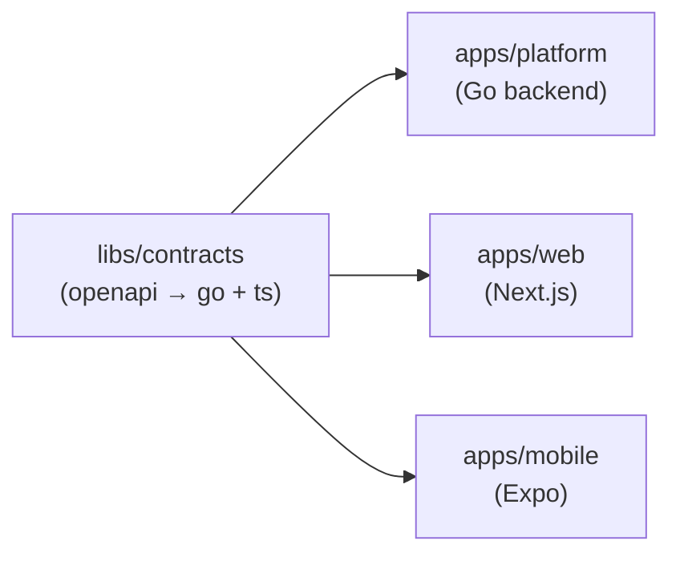

# ADR 0006 — Monorepo consolidation and Nx build orchestration

**Status:** Accepted
**Date:** 2026-05-05
**Deciders:** Solution architecture
**Updates:** [docs/architecture/14-tech-stack.md](../architecture/14-tech-stack.md) (replaces the three-repo structure), [docs/architecture/17-cicd.md](../architecture/17-cicd.md) (adds Nx CI layer)

## Context

[14-tech-stack.md](../architecture/14-tech-stack.md) originally split trustC across three separate repos (`trustc-platform`, `trustc-web`, `trustc-mobile`), citing different toolchains, release cadences, and reviewer pools as justification.

Forces that now favour consolidation:

- Cross-cutting changes (e.g. a new field in an OpenAPI spec that affects the Go server, the web client, and the mobile client) currently require coordinated PRs across three repos — slow and error-prone.
- Contract drift (Go server vs. generated TypeScript client) is easier to catch in a single CI run that has both in scope.
- A unified build cache and affected-task detection (only test what changed) reduces CI wall-clock time as the codebase grows.
- The toolchain difference (Go vs. Node.js) is a weak reason to split repos once a polyglot build tool exists that handles both.
- Release cadence for web is already continuous (same as backend); only mobile ships on a slower clock, but that is managed by EAS, not repo topology.

## Decision

Consolidate into **one monorepo** (`trustc`) and use **Nx** as the top-level build orchestrator alongside **pnpm workspaces** for Node.js packages. Taskfile remains the Go-specific task executor, called by Nx targets.

### Repository structure

```
trustc/
├── apps/
│   ├── platform/              # Go backend (single go.mod, all 8 services)
│   │   ├── cmd/
│   │   ├── services/
│   │   ├── internal/
│   │   ├── migrations/
│   │   ├── tools/
│   │   ├── go.mod
│   │   ├── go.sum
│   │   ├── Taskfile.yml       # Go tasks (generate, migrate, lint, test, build)
│   │   └── project.json       # Nx project descriptor — wraps Taskfile targets
│   ├── web/                   # Next.js (App Router)
│   │   ├── app/
│   │   ├── package.json
│   │   └── project.json
│   └── mobile/                # Expo / React Native
│       ├── app/
│       ├── package.json
│       └── project.json
├── libs/
│   └── contracts/             # OpenAPI 3.1 specs + generated @trustc/contracts npm pkg
│       ├── openapi/           # source-of-truth specs
│       ├── generated/go/      # oapi-codegen output (symlinked into apps/platform)
│       ├── generated/ts/      # openapi-typescript output
│       └── project.json
├── infrastructure/
│   ├── terraform/
│   ├── kubernetes/
│   └── compose/
├── .github/
│   └── workflows/
├── nx.json                    # Nx workspace config, target defaults, cache inputs
├── package.json               # pnpm workspace root
└── pnpm-workspace.yaml        # includes apps/* and libs/*
```

### How Nx and Taskfile divide responsibility

| Concern | Tool | Why |
| --- | --- | --- |
| Affected-task detection | Nx | Nx tracks file → project relationships; `nx affected` runs only impacted targets |
| Remote / local build cache | Nx | Skips targets whose inputs haven't changed since the last run |
| Task dependency graph | Nx | `build` depends on `contracts:generate`; Nx enforces ordering |
| Go build, test, lint, generate, migrate | Taskfile (via Nx target) | Taskfile stays as the developer-facing Go task runner; Nx calls `task <target>` |
| Node.js build, test, lint | Nx native (Next.js, Expo plugins) | First-class Nx project types |
| Contract generation (OpenAPI → Go + TS) | Nx target in `libs/contracts` | Single source; both downstream consumers declare it as a dependency |
| CI orchestration | Nx + GitHub Actions | `nx affected` replaces per-repo conditional job logic |

### Nx project graph (abbreviated)



A change to `libs/contracts/openapi/` marks all three app projects as affected; `nx affected --target=lint,test,build` runs all three in parallel with the correct ordering.

### Nx target definitions (illustrative)

`apps/platform/project.json`:

```json
{
  "name": "platform",
  "targets": {
    "generate": { "executor": "nx:run-commands", "command": "task generate", "options": { "cwd": "apps/platform" } },
    "lint":     { "executor": "nx:run-commands", "command": "task lint",     "options": { "cwd": "apps/platform" } },
    "test":     { "executor": "nx:run-commands", "command": "task test",     "options": { "cwd": "apps/platform" } },
    "build":    { "executor": "nx:run-commands", "command": "task build",    "options": { "cwd": "apps/platform" }, "dependsOn": ["generate"] }
  }
}
```

## Alternatives considered

- **Keep three repos, add Taskfile** — no affected detection across repos; contract drift still possible; cross-repo changes still require N PRs. **Reject.**
- **Turborepo** — excellent JS/TS caching; no native Go support; would require a two-tool world (Turborepo + Taskfile with no integration). **Reject** in favour of Nx which wraps arbitrary commands as targets.
- **Dagger** — CI-as-code, identical local/CI execution; adds Docker-in-Docker runtime; was explicitly deferred in ADR 0005. **Reject** for this use case; may revisit for complex multi-arch image builds.
- **Bazel / Pants** — hermetic, excellent caching at scale; enormous operational weight; team has no Bazel experience. **Reject** until team size or build time justifies the complexity.
- **Moon (moonrepo)** — native Go + TS support; younger ecosystem, smaller community, fewer integrations. **Reject for now**; revisit if Nx's Go support via `nx-go` proves insufficient.

## Consequences

### Positive

- One clone, one CI pipeline, one PR for cross-cutting changes.
- `nx affected --target=test` means a Go-only PR doesn't re-run web and mobile suites.
- Contract drift caught in the same CI run that changed the spec.
- Remote cache (Nx Cloud or self-hosted) can skip unchanged targets across CI runs.
- Taskfile stays intact — Go developers' workflow is unchanged.

### Negative

- Node.js toolchain (`pnpm`, `node`) is now a dev dependency for anyone working on the Go backend (to run Nx commands).
  - Mitigated: `task <target>` still works directly without Nx if a Go developer prefers to skip the Nx layer.
- Single repo means a broken `main` in web or mobile can block backend CI if not guarded by `nx affected`.
  - Mitigated: Nx affected scoping and per-project CI job conditions.
- `nx-go` plugin is community-maintained; if it falls behind, the Nx wrapping of Go targets requires manual `project.json` maintenance (straightforward but manual).

### Revisit when

- Go targets require hermetic builds (native deps, CGO) — at that point, Bazel `rules_go` becomes a better fit.
- Team splits into independent squads with genuinely different release gating — at that point, re-evaluate polyrepo.

## Related

- [docs/architecture/14-tech-stack.md](../architecture/14-tech-stack.md) — updated to reflect monorepo structure
- [docs/architecture/17-cicd.md](../architecture/17-cicd.md) — updated to document Nx-based CI
- [ADR 0005](./0005-go-workspace-and-build.md) — Go module structure unchanged; Taskfile unchanged
- [ADR 0001](./0001-monorepo-tooling.md) — original monorepo attempt (Turborepo + NestJS); superseded by ADR 0005
