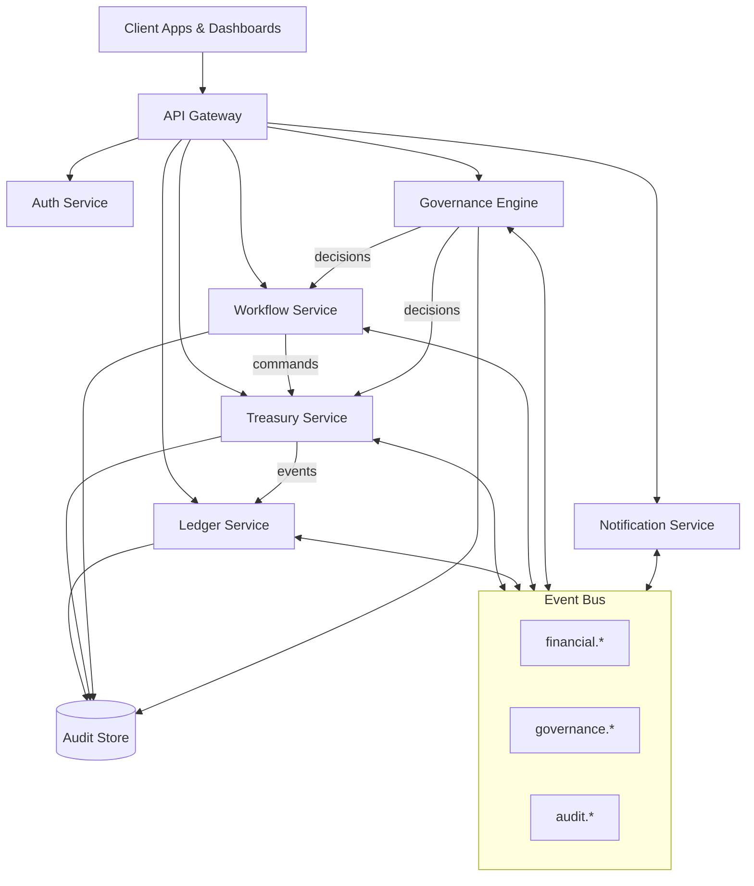
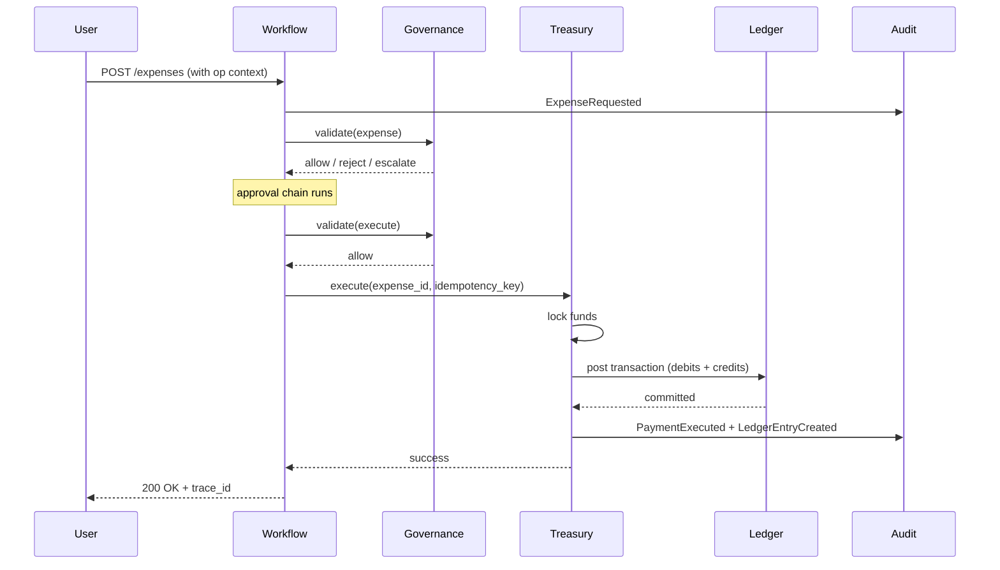

# 00 — System Overview

> **Read this first.** One-page summary of what trustC is, what it isn't, and how the major pieces fit together. Sources: PRD §1–§5, §90, §143–§145, §195.

## What trustC is

trustC is a **programmable financial operating system**. Its job is to make unauthorized capital movement structurally impossible — not by detecting it after the fact, but by refusing to execute it at the infrastructure layer.

The product replaces "people are trusted, the system records what they do" with "the system enforces rules, people operate within them" (PRD §193).

## What problem it solves

Traditional finance stacks (accounting + ERP + treasury + bank) leave four gaps:

1. **Operational ↔ financial drift.** Spending happens, accounting reflects it days later (or never).
2. **Trust-based controls.** Approvals are policy in PDFs, not enforced in code.
3. **Treasury sprawl.** Operators with day-to-day access can move capital outside intended boundaries.
4. **Investor opacity.** Capital providers see snapshots, not real-time flows.

trustC closes all four by coupling every financial action to an operational workflow, evaluating policy at execution time, isolating treasury control from operational actors, and exposing real-time state to investors.

## What it is *not*

| Not | Because |
| --- | --- |
| A retail bank | No customer accounts, no card issuance, no consumer-facing money movement |
| A crypto exchange / DEX | Custody and exchange are out of scope |
| A consumer payments gateway | All actors are organizational |
| Tax filing software | We produce auditable records; we do not file |
| A general-purpose ERP | Single concern: capital governance |

## High-level architecture

## The seven services

| Service | Owns | Talks to |
| --- | --- | --- |
| **Auth** | Identities, roles, sessions, signing keys | Everyone (auth check + actor identity) |
| **Workflow** | Expense / payment lifecycles, approval chains | Treasury, Governance |
| **Treasury** | Wallets, budgets, fund states, allocations, locks | Ledger (always), Governance (gate) |
| **Ledger** | Append-only double-entry accounting, balances | Nothing — pure sink + read model |
| **Governance** | Policy evaluation, risk scoring, decisions | Workflow, Treasury (gate before execute) |
| **Audit** | Immutable event log, hash chain, investigation queries | All services write here |
| **Notification** | Email / webhook / in-app delivery | All services emit notification events |

Detailed responsibilities and non-responsibilities for each: [03-services.md](./03-services.md).

## How a typical request flows

Every arrow above is an event, idempotent, signed, and audited.

## Why this is hard (and what to optimize for)

Priority order, when in doubt (PRD §39):

1. **Integrity** — wrong answers are worse than slow answers
2. **Auditability** — every action must be reconstructable
3. **Determinism** — same input → same output, always
4. **Security** — assume hostile insiders
5. **Scalability** — 1M ledger entries / day target
6. **Developer convenience** — last

If a design simplifies developer experience by sacrificing #1–#4, it's the wrong design.

## Where to go next

- Non-negotiable rules every doc and every line of code must respect: [01-principles.md](./01-principles.md)
- How we'll actually build it, in what order: [15-roadmap.md](./15-roadmap.md)
- The most load-bearing subsystem: [06-ledger.md](./06-ledger.md)
