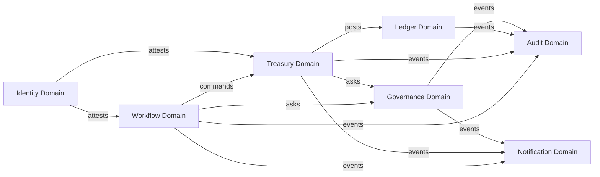

# 02 — Domains & Bounded Contexts

> Where the lines are drawn between subsystems and what each owns. Sources: PRD §64–§65, §121–§123.

trustC follows strict Domain-Driven Design boundaries. The "shared god service" pattern is forbidden (PRD §64). When in doubt about where a concept belongs, default to the smallest domain that needs to know about it.

## Core domains

## Ownership matrix

| Domain | Owns (single source of truth) | Does NOT own |
| --- | --- | --- |
| **Identity** | Users, roles, sessions, signing keys, RBAC policies | Business approval logic, financial policy |
| **Workflow** | Expense / payment lifecycles, approval chains, workflow definitions | Accounting entries, fund movement, policy rules |
| **Treasury** | Wallets, budgets, fund states, allocations, locks, escrow positions | Accounting truth, approval state |
| **Ledger** | Accounts, ledger entries, balances (as projections), transactions | Business approval, fund routing |
| **Governance** | Policies, policy decisions, risk scores, evaluation history | Workflow execution, treasury balances |
| **Audit** | Immutable event chain, audit query API, investigation primitives | Anything mutable |
| **Notification** | Notification channels, delivery state, templates | The events themselves (only consumes them) |

## Bounded context rules

### Treasury context

Responsible for: fund allocation, locks, releases, capital routing.

Not responsible for:

- Accounting logic (Ledger owns the truth)
- Approval workflows (Workflow owns the lifecycle)
- Policy decisions (Governance owns the gate)

When Treasury needs to move money, it: (a) asks Governance whether to allow it, (b) updates its own fund-state tables, (c) emits a domain event that Ledger consumes to write the accounting entries.

### Ledger context

Responsible for: financial truth, accounting entries, balance projections.

Not responsible for: business approvals, fund routing, policy evaluation.

The Ledger does **not** call out to other domains. It is a pure event sink and read model. If you find yourself adding an HTTP client to the Ledger, stop and rethink — that's a leak.

### Governance context

Responsible for: validation, policy enforcement, anomaly analysis, decision explainability.

Not responsible for: executing the actions it permits. Governance returns `allow / reject / escalate` plus reasons; it never moves money or updates workflows.

### Workflow context

Responsible for: approval orchestration, lifecycle state machines, approval chain integrity.

Not responsible for: deciding *whether* an action is allowed (Governance), or actually moving funds (Treasury).

### Identity context

Responsible for: knowing who an actor is, what roles they hold, what cryptographic keys they sign with.

Not responsible for: deciding what those roles are *allowed to do* in any specific business context — that's Governance, parameterized by Identity claims.

### Audit context

Responsible for: receiving every domain event, hash-chaining them, providing time-travel and investigation queries.

Not responsible for: anything that changes state. The Audit service has no write API exposed beyond the internal event ingest.

### Notification context

Responsible for: delivering notifications across channels (email, SMS, webhook, in-app).

Not responsible for: deciding *what* is notification-worthy — other services emit `notification.*` events; Notification routes them.

## Cross-domain communication rules

| From → To | Allowed channels | Forbidden |
| --- | --- | --- |
| Workflow → Governance | Synchronous request (decision must block execution) | Direct DB read |
| Workflow → Treasury | Async command via event bus, with idempotency key | Synchronous "transfer money" RPC |
| Treasury → Ledger | Event (Ledger consumes, posts entry, acks) | Direct DB write into ledger tables |
| Any → Audit | Async event emission | Direct DB write |
| Any → Notification | Async event emission | Direct DB write |
| Any → Identity | Synchronous lookup of identity claims | Direct DB read of `users` table |

Forbidden across the board:

- **Shared mutable business logic** — no `@trustc/shared-domain` package. Shared code is limited to types, event contracts, and protocol-level utilities.
- **Reading another domain's tables directly.** Even within the same Postgres instance, every domain has its own schema with no cross-schema reads.
- **Distributed transactions across domains.** Use the saga / outbox pattern (see [05-events.md](./05-events.md)).

## When boundaries are tempting to break

Three places where engineers often want to violate these rules — and what to do instead:

| Temptation | Why it's wrong | Right answer |
| --- | --- | --- |
| "Workflow needs to check the wallet balance to decide if approval is possible" | Workflow becomes coupled to Treasury internals | Ask Governance with `{action: spend, amount, wallet_id}` — Governance reads Treasury state |
| "Ledger needs to know if a vendor is verified before posting" | Mixes business policy into accounting | Verification is checked upstream; if it gets to Ledger, it's authorized — Ledger just records |
| "Treasury needs the user's email for the notification" | Couples Treasury to Identity and Notification | Treasury emits an event with `actor_id`; Notification looks up the email itself |

## See also

- [03-services.md](./03-services.md) — service-level breakdown
- [05-events.md](./05-events.md) — how cross-domain communication actually happens on the wire
