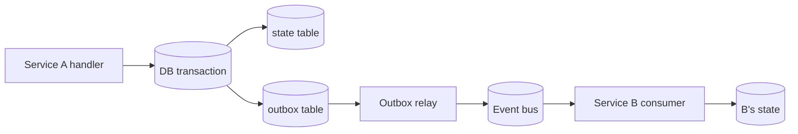

# 05 — Events & Event Sourcing Strategy

> The event taxonomy, contract standard, and the strategy we use to keep state consistent across services. Sources: PRD §22, §23, §50, §66–§68.

trustC is event-driven. Every state-changing action emits at least one event. Cross-service coordination is async by default; synchronous calls are limited to gates (Governance) and reads.

## Event sourcing approach

We use **CRUD-with-outbox**, not pure event sourcing. Decision: [ADR 0002](../adr/0002-event-sourcing-vs-outbox.md).

In short:

- Each service owns a Postgres schema with **state tables** (the current truth) and an **outbox table** (events to publish).
- A single DB transaction writes both the state change and the outbox row.
- A relay process publishes outbox rows to the event bus and marks them dispatched.
- Other services consume events into their own state tables.

The Ledger and Audit domains are the exception: they are **pure event-derived**. The Ledger's "tables" are projections of the events that produced them, and any account balance can be reconstructed by replay.



## Event contract standard

Every event MUST conform to this envelope (PRD §23):

```json
{
  "event_id": "uuid",
  "event_type": "workflow.expense.approved",
  "schema_version": 1,
  "timestamp": "2026-05-02T10:15:30.123Z",
  "actor_id": "uuid | null",
  "organization_id": "uuid",
  "correlation_id": "uuid",
  "causation_id": "uuid | null",
  "source_service": "workflow-service",
  "source_event_id": "uuid | null",
  "payload": { /* event-specific */ },
  "signature": "base64-of-ed25519(signing_key, canonical_envelope_minus_signature)"
}
```

### Field rules

| Field | Required | Notes |
| --- | --- | --- |
| `event_id` | Yes | Globally unique, generated at producer |
| `event_type` | Yes | Dot-namespaced: `<domain>.<entity>.<action>` |
| `schema_version` | Yes | Integer, incremented on any payload-shape change |
| `timestamp` | Yes | ISO-8601 UTC, microsecond precision |
| `actor_id` | Yes/null | Null only for system-generated events |
| `organization_id` | Yes | Multi-tenant scope; never null for tenanted events |
| `correlation_id` | Yes | Identifies the end-to-end business operation |
| `causation_id` | No | The `event_id` of the event that caused this one (for lineage) |
| `source_service` | Yes | Producer service name |
| `source_event_id` | No | If this event was produced in response to another |
| `payload` | Yes | Event-specific, validated against `event_type` + `schema_version` |
| `signature` | Yes | Ed25519 over canonical-JSON envelope minus the signature field itself |

### Schema versioning rules

- A new field in `payload` that consumers can ignore: same version, additive only.
- Removing a field, renaming a field, or changing a field's type: bump `schema_version`.
- Old versions are supported for at least 30 days after a new version is deployed.

## Event naming convention

`<domain>.<entity>.<past-tense-action>`

Examples:
- `workflow.expense.submitted`
- `treasury.funds.locked`
- `ledger.transaction.committed`
- `governance.decision.escalated`

Never present tense. Events are facts that happened.

## Event taxonomy

### Financial events (Treasury + Ledger)

| Event | Producer | Trigger |
| --- | --- | --- |
| `workflow.expense.submitted` | Workflow | Requestor submits |
| `workflow.expense.approved` | Workflow | All approvals collected |
| `workflow.expense.rejected` | Workflow | Any rejection |
| `treasury.funds.allocated` | Treasury | Allocate budget → fund position |
| `treasury.funds.locked` | Treasury | Funds reserved for a workflow / escrow |
| `treasury.funds.released` | Treasury | Locked funds freed (paid out or refunded) |
| `treasury.payment.executed` | Treasury | Payment instructed |
| `treasury.transaction.committed` | Treasury | Atomic command for ledger to post entries |
| `ledger.transaction.committed` | Ledger | Entries written successfully |
| `escrow.created` | Treasury | New escrow position |
| `escrow.released` | Treasury | Conditions met, payment released |
| `escrow.refunded` | Treasury | Conditions failed, refund issued |
| `payroll.allocated` | Treasury | Payroll cycle allocated |
| `payroll.salary.transferred` | Treasury | Individual salary paid |
| `currency.conversion.recorded` | Treasury | FX conversion |

### Governance events

| Event | Producer | Trigger |
| --- | --- | --- |
| `governance.decision.allowed` | Governance | Policy evaluation result |
| `governance.decision.rejected` | Governance | Policy evaluation result |
| `governance.decision.escalated` | Governance | Risk above threshold |
| `governance.policy.violation_detected` | Governance | Runtime monitoring |
| `governance.budget.threshold_exceeded` | Governance | Budget drift |
| `governance.transaction.suspicious` | Governance | Risk model alert |
| `governance.access.unauthorized_attempt` | Governance | Defensive event |
| `governance.freeze.triggered` | Governance | Emergency freeze engaged |

### Audit events

These are emitted by all services for every state-changing operation. They mirror the underlying domain events but with full request / context metadata.

| Event | Source |
| --- | --- |
| `audit.actor.authenticated` | Auth |
| `audit.actor.session_created` | Auth |
| `audit.workflow.modified` | Workflow |
| `audit.approval.granted` | Workflow |
| `audit.approval.rejected` | Workflow |
| `audit.treasury.allocation` | Treasury |
| `audit.treasury.lock` | Treasury |
| `audit.treasury.release` | Treasury |
| `audit.ledger.transaction_posted` | Ledger |
| `audit.governance.decision` | Governance |
| `audit.admin.override_attempted` | Any |

### Notification triggers

| Event | Producer | Consumer |
| --- | --- | --- |
| `notification.expense.approved` | Workflow | Notification |
| `notification.expense.rejected` | Workflow | Notification |
| `notification.payment.failed` | Treasury | Notification |
| `notification.budget.exceeded` | Governance | Notification |
| `notification.escrow.released` | Treasury | Notification |
| `notification.suspicious_activity` | Governance | Notification |

## Idempotency & deduplication

- All consumers must dedupe on `event_id`.
- Producers may safely re-publish from the outbox after a crash; consumers will see duplicates.
- HTTP commands (the API surface) require an `Idempotency-Key` header that is hashed into the resulting event's payload.
- `(organization_id, idempotency_key)` is a unique constraint on every command-receiving table.

## Replay

PRD §50 requires replay-safety. Practically:

- Every consumer must be able to rebuild its state from the bus from `event_id = 0` to now, deterministically.
- Migrations that change projection logic must include a replay step in the deploy plan.
- The Audit service maintains a long-retention archive (write-once object storage) for replay beyond the bus's retention window.

## Choreography vs orchestration

Default to **choreography** (services react to events, no central conductor).

Use **orchestration** (Workflow service tells others what to do) only for the expense-approval lifecycle, where a deterministic sequential flow with rollback is required.

A central rule: **the Treasury never executes a payment without an inbound event** carrying a Workflow-issued, Governance-approved authorization. There is no "execute payment" RPC — only an event consumer.

## See also

- [02-domains.md](./02-domains.md) — which domains may emit/consume what
- [06-ledger.md](./06-ledger.md) — how Ledger consumes Treasury events
- [11-audit-observability.md](./11-audit-observability.md) — how Audit consumes everything
- [ADR 0002](../adr/0002-event-sourcing-vs-outbox.md), [ADR 0003](../adr/0003-messaging-nats-vs-kafka.md)
