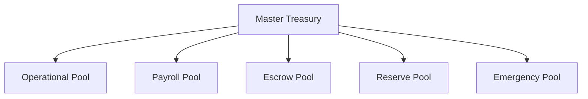
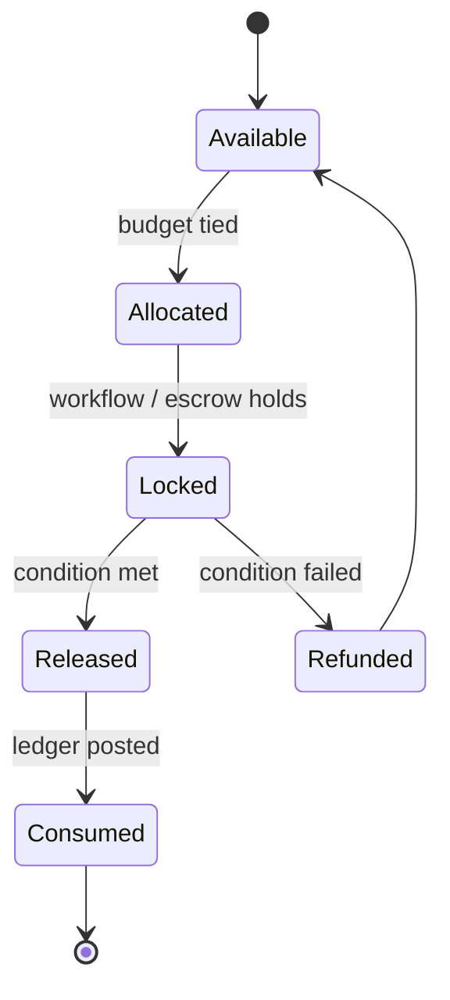

# 07 — Treasury Service

> Holds and routes capital under governance constraints. Sources: PRD §6.3, §28, §73, §74, §124, §152–§153.

## Mental model

Treasury is **not** a wallet app. It is a governance-controlled capital routing system. The job is to ensure that every dollar moves only after the right people have agreed and the right policies have permitted, and that the movement leaves an immutable trail.

Treasury's tables describe **fund positions and intent**. The accounting truth lives in the Ledger.

## Responsibilities

- Wallet management (per organization, segmented by purpose)
- Budget allocation and tracking
- Fund-state lifecycle (`available → allocated → locked → released → consumed | refunded`)
- Escrow positions and conditional release
- Issuing payments by emitting Ledger transaction events

## Non-responsibilities

- Accounting (Ledger)
- Approval orchestration (Workflow)
- Policy decisions (Governance — but Treasury *asks* Governance before executing)

## Wallet segmentation

Per PRD §124, treasury capital is segmented by risk profile and purpose:



| Segment | Purpose | Funded from | Drains to |
| --- | --- | --- | --- |
| `operational` | Day-to-day expenses | Master / investor capital | Vendor payments, expenses |
| `payroll` | Salaries only | Master | Employee wallets |
| `escrow` | Locked funds awaiting release conditions | Operational | Released to suppliers, refunded to operational |
| `reserve` | Emergency liquidity | Master | Operational (with elevated approval) |
| `emergency` | Crisis-only spending | Master | Anything (with multi-sig + audit) |

Cross-segment movement requires its own workflow and is logged distinctly.

## Fund-state machine

A `fund_position` represents a chunk of money allocated for a specific purpose. Its lifecycle:



| Transition | Trigger | Side effects |
| --- | --- | --- |
| `Available → Allocated` | Budget allocation command | Audit event |
| `Allocated → Locked` | Workflow approval / escrow creation | Cannot be allocated elsewhere |
| `Locked → Released` | Payment executed (Treasury → Ledger) | Ledger txn posted |
| `Locked → Refunded` | Escrow refund or workflow cancellation | Ledger txn posted, position returns to Allocated → Available |
| `Released → Consumed` | Ledger commit acknowledged | Position retired |

Constraints:
- Funds in `Locked` cannot be reused for any other purpose (T-1).
- Transitions follow the FSM strictly — no skipping (T-4).
- Each transition produces exactly one Ledger transaction (T-3).

## Budget governance

Budgets are policy-constrained resource containers, not balances (PRD §43, §74).

### Budget constraints

A budget defines:
- `allocated_amount` — the cap for the period
- `reset_cycle` — `none | monthly | quarterly | annual`
- `allowed_receivers` — actor / vendor types this budget can pay
- `forbidden_receivers` — explicit deny list (e.g. payroll budget cannot pay vendors)

These are evaluated by the Governance Engine at workflow time, not enforced inside Treasury directly. Treasury is the executor, Governance is the gate.

### Budget states

```
active → restricted → frozen → active   (admin-driven)
active → expired                        (time-driven)
```

Per PRD §154. Frozen budgets reject all allocation commands.

## Escrow

See [10-escrow.md](./10-escrow.md) for the full escrow design. Treasury's role:

- Create the `escrow` row when the workflow reaches a "lock funds" step
- Move the corresponding `fund_position` to `Locked`
- On release: transition fund to `Released → Consumed`, emit ledger txn
- On refund: transition fund to `Refunded → Available`, emit reversing ledger txn

## Treasury → Ledger contract

Treasury never updates the Ledger by directly writing to its tables. The only path:

1. Treasury commits its own state change (e.g. fund position to `Released`)
2. In the same DB transaction, Treasury writes a `treasury.transaction.committed` event to its outbox
3. The outbox relay publishes the event
4. Ledger consumes the event, validates double-entry, writes entries, emits `ledger.transaction.committed`

If the Ledger rejects the transaction, Treasury sees the rejection event and triggers a compensating action (which itself is governed and audited).

## Concurrency

PRD §31 forbids race-condition-prone balance updates. Mechanisms:

- **Optimistic locking** on `wallet`, `budget`, `fund_position` via `version` column. Updates do `UPDATE ... WHERE version = $expected_version`; conflicts retry up to N times then bubble up.
- **Idempotency keys** on every command. Duplicate command with same key returns the original result.
- **Per-wallet serialization** for high-contention wallets via Postgres advisory locks.

## API surface

| Method | Path | Purpose |
| --- | --- | --- |
| `POST` | `/treasury/allocate` | Allocate funds from wallet to budget |
| `POST` | `/treasury/lock` | Lock allocated funds for a workflow / escrow |
| `POST` | `/treasury/release` | Release locked funds (executes payment) |
| `POST` | `/treasury/refund` | Refund locked funds back to budget |
| `POST` | `/escrow` | Create escrow position |
| `POST` | `/escrow/{id}/release` | Release escrow on condition met |
| `POST` | `/escrow/{id}/refund` | Refund escrow on condition failed |
| `GET`  | `/wallets/{id}` | Wallet metadata + derived balance |
| `GET`  | `/budgets/{id}` | Budget metadata + derived utilization |
| `GET`  | `/fund-positions?workflow_id=...` | Lookup positions by workflow |

All write endpoints require `Idempotency-Key`, `X-Actor-ID`, `X-Correlation-ID` (see [13-api-standards.md](./13-api-standards.md)).

## Liquidity protection

Per PRD §152:

- Treasury continuously monitors `liquidity_ratio = available / short_term_obligations` per wallet segment.
- When the ratio drops below configured thresholds, Treasury emits `governance.alert.liquidity_low` events.
- Governance may respond by tightening policies or freezing nonessential spending.

Treasury itself does not make policy decisions; it surfaces signals.

## Performance targets

| Operation | Target (PRD §56) |
| --- | --- |
| Allocate / lock / release | < 200 ms p99 (includes governance check) |
| Wallet balance read | < 50 ms p99 (cached) |

## See also

- [04-data-model.md](./04-data-model.md) — wallet, budget, fund_position schemas
- [06-ledger.md](./06-ledger.md) — what Treasury produces for Ledger
- [09-governance.md](./09-governance.md) — the gate Treasury checks before every release
- [10-escrow.md](./10-escrow.md) — escrow specifics
