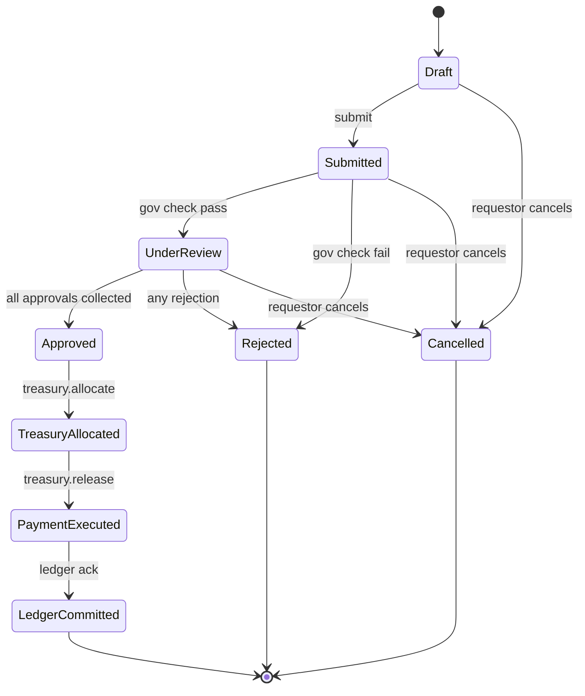
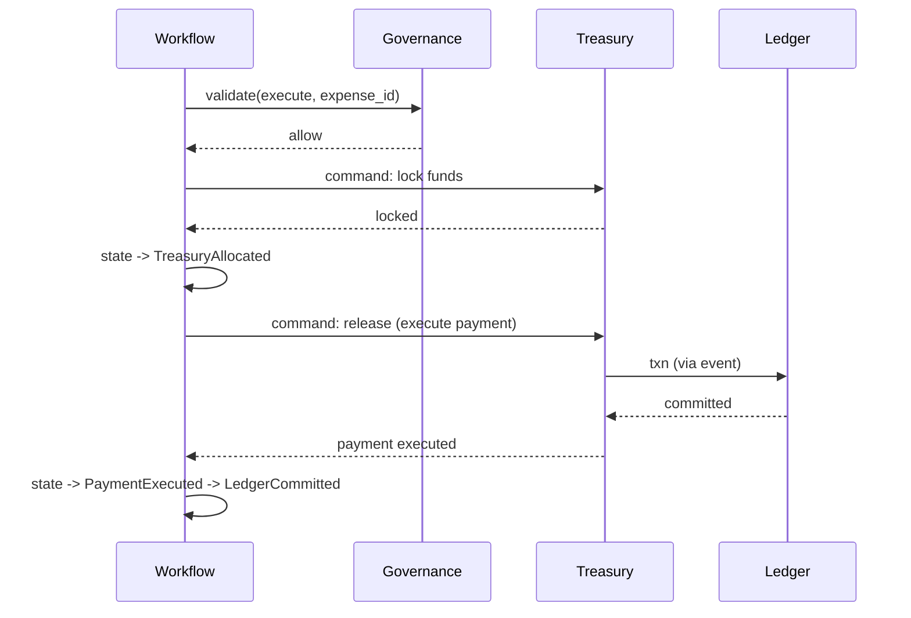

# 08 — Workflow Engine

> Deterministic orchestration of expense and payment lifecycles. Not a simple approval table — a full state-machine engine. Sources: PRD §6.2, §21, §42, §122–§123.

## What the Workflow service does

- Owns the lifecycle of expense / payment requests
- Executes approval chains as defined per organization
- Calls Governance at decision points
- Issues commands to Treasury once fully approved
- Provides workflow definition management for admins

## What it does not do

- Decide whether something is allowed (Governance)
- Move money (Treasury)
- Generate ledger entries (Ledger)

## Core entities

- **Workflow definition** — the template (steps, approvers, policies) for a class of requests
- **Workflow instance** — a running execution of a definition
- **Expense request** — the canonical workflow instance type for v1
- **Approval step** — one node in an approval chain
- **Approval** — the immutable record of a step decision
- **Transition** — a state change on the instance

## Expense request state machine



### Hard rules

- **No skipped states.** Every transition is explicit and checked.
- **No backward transitions** except `Submitted → Draft` (allowed only by the requestor before any approval).
- **Rejected is terminal.** Cannot reopen — submit a new request.
- **Approved is irreversible.** Once approved, the only forward path is execute or cancel; cancellation after approval requires elevated permission and an audit event.
- **LedgerCommitted is final.** No edits, ever.

## Approval chains

A workflow definition declares a sequential list of steps. Each step has:

- `step_index` — 0-based ordering
- `approver_selector` — who can approve (role, named actor, or rule like "any finance_operator in org X")
- `min_approvals` — typically 1; multi-sig steps use higher values
- `policy_check` — optional Governance call before this step's approval is even allowed
- `sla_minutes` — soft deadline; emits an alert if exceeded (PRD §155–§156)

### Integrity rules (PRD §122)

- The chain is **immutable after submission.** Modifying a workflow definition does not affect in-flight instances.
- An approver cannot approve their own request (overridable only by an explicit per-org policy).
- Approvals are append-only; once submitted, an approval's signature, reason, and timestamp cannot change.
- A single actor cannot occupy multiple approval roles for the same request (no "wearing two hats").

## Governance integration

Workflow calls Governance at three points:

1. **At submission** — pre-validate the request shape, budget existence, requestor permissions
2. **At each approval step** — check whether *this approver* should be allowed to act on *this request* given current state
3. **Before execution** — final go/no-go after all approvals collected

Governance returns one of:
- `allow` — proceed
- `reject` — terminal failure, with reason
- `escalate` — requires additional approval beyond the declared chain (e.g. high amount → investor approval per PRD §82)

`escalate` dynamically extends the chain. The original definition is preserved; the extension is recorded as a separate `chain_extension` row tied to the instance.

## Approval signing

Every approval submission carries a cryptographic signature:

```
signature = Ed25519(approver_signing_key, canonical(
  expense_request_id,
  step_index,
  decision,
  reason_hash,
  timestamp
))
```

Verified at write time. Stored alongside the approval (immutably). Allows third parties (auditors) to verify approvals were made by the claimed approver.

## Saga orchestration: approved → paid

Once `Approved` is reached, Workflow drives the execution saga:



If any step fails, Workflow runs the compensating saga:

| Failure point | Compensation |
| --- | --- |
| Lock fails | State → `Rejected` with reason "treasury_lock_failed"; no money moved |
| Release fails | Treasury refunds the lock; state → `Rejected`; reversing ledger txn (none, since none was posted) |
| Ledger commit fails | This is a critical alert. Treasury holds funds locked, manual investigation. |

## Workflow definition management

Definitions are versioned. Editing a definition produces a new version; in-flight instances continue on their original version.

```
workflow_definition (id, organization_id, name, version, ...)
workflow_step       (definition_id, step_index, ...)
```

Soft-deletion of a definition is allowed (operational entity), but historical instances remain queryable forever.

## API surface

| Method | Path | Purpose |
| --- | --- | --- |
| `POST` | `/expenses` | Create draft expense |
| `POST` | `/expenses/{id}/submit` | Submit for approval |
| `POST` | `/expenses/{id}/approve` | Cast an approval |
| `POST` | `/expenses/{id}/reject` | Cast a rejection |
| `POST` | `/expenses/{id}/cancel` | Requestor cancellation |
| `GET`  | `/expenses/{id}` | Full state + approval history |
| `GET`  | `/expenses?status=...&actor_id=...` | Listing |
| `POST` | `/workflow-definitions` | Admin: create / version a definition |

## Performance targets

| Operation | Target (PRD §56) |
| --- | --- |
| Submit | < 200 ms p99 |
| Approve (incl. governance) | < 250 ms p99 |
| Listing query | < 300 ms p95 |

## See also

- [09-governance.md](./09-governance.md) — what Governance returns at each call site
- [07-treasury.md](./07-treasury.md) — the commands Workflow issues
- [04-data-model.md](./04-data-model.md) — `expense_request`, `approval` schemas
