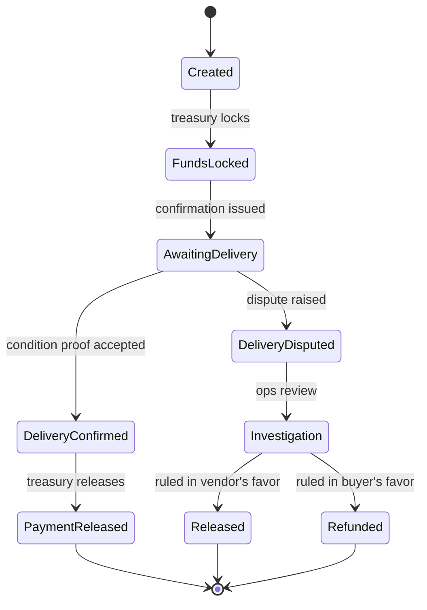
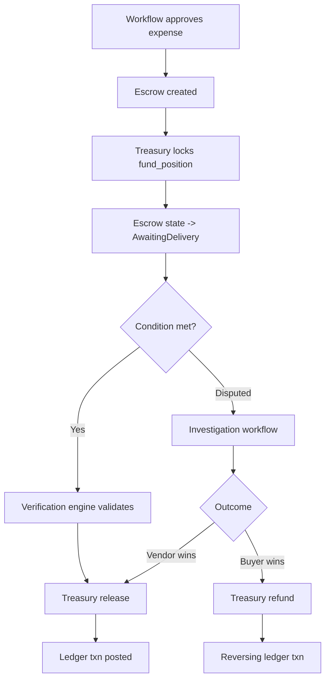

# 10 — Escrow

> Conditional release of funds with cryptographic and audit guarantees. Sources: PRD §21.2, §30, §125–§126.

## What escrow is

A mechanism for locking funds against a future condition. Common use: vendor pays only when delivery is verified.

## What it is not

- A payment processor
- A general-purpose conditional-payment platform (out of scope for v1; the design supports it as a future extension)

## State machine



## Constraints (PRD §30, §125)

- Locked escrow funds **cannot** be reused for any other purpose (T-1)
- Release requires a valid confirmation event matching the declared `release_condition`
- Refund requires an audit record explaining why
- All transitions emit ledger entries via Treasury

## Release conditions

`release_condition` is structured JSON describing what proof is required. v1 supports:

```json
{
  "type": "manual_confirmation",
  "required_approvers": ["role:finance_operator"],
  "min_approvals": 1
}
```

```json
{
  "type": "document_verification",
  "required_documents": ["delivery_receipt", "invoice"],
  "verifier_role": "finance_operator"
}
```

```json
{
  "type": "multi_factor",
  "all_of": [
    { "type": "manual_confirmation", "min_approvals": 1 },
    { "type": "document_verification", "required_documents": ["delivery_receipt"] }
  ]
}
```

Future condition types (oracle-based, time-locked) are out of scope for v1.

## Escrow flow



## Verification engine

A small subsystem inside the Treasury service that:

1. Receives a release request with claimed proof
2. Looks up the escrow's `release_condition`
3. Validates each component (approvers signed? documents present? oracle reading within tolerance?)
4. Returns `valid + signature` or `invalid + reasons`

The verification result is itself audited. Failed verifications do not retire the escrow — they leave it in `AwaitingDelivery` with the failure recorded.

## Ledger impact

| Transition | Ledger entries (illustrative) |
| --- | --- |
| `Created → FundsLocked` | Debit `escrow_asset`, Credit `cash` (or transfer wallet → escrow segment) |
| `FundsLocked → PaymentReleased` | Debit `vendor_expense`, Credit `escrow_asset` |
| `FundsLocked → Refunded` | Debit `cash`, Credit `escrow_asset` (reverses the lock) |

Exact accounts depend on the org's chart of accounts; the *shape* of the entries is fixed.

## Dispute handling

A dispute moves the escrow into `Investigation`, which:

- Creates a separate workflow (governance-tracked) requiring elevated approvers
- Pauses any auto-release timers
- Surfaces the dispute on investor dashboards
- Resolves with either `Released` or `Refunded`, never silently times out

Disputes are first-class entities, not free-text fields:

```
escrow_dispute {
  id, escrow_id, raised_by, reason, status, resolution, resolution_reason, ...
}
```

## Supplier risk feedback

Per PRD §126, escrow outcomes feed supplier risk profiles:

- Successful release → small positive trust signal
- Dispute won by buyer → significant negative signal
- Refund without dispute → neutral

These signals are consumed by Governance's `supplier` evaluator.

## API surface

| Method | Path | Purpose |
| --- | --- | --- |
| `POST` | `/escrow` | Create (called by Workflow on approval) |
| `POST` | `/escrow/{id}/lock` | Treasury locks funds |
| `POST` | `/escrow/{id}/release` | Submit release with proof |
| `POST` | `/escrow/{id}/dispute` | Raise dispute |
| `POST` | `/escrow/{id}/resolve` | Resolve investigation |
| `GET`  | `/escrow/{id}` | Status + history |

All write endpoints require `Idempotency-Key`.

## Performance targets

| Operation | Target |
| --- | --- |
| Create / lock | < 200 ms p99 |
| Release (with verification) | < 300 ms p99 |

## See also

- [07-treasury.md](./07-treasury.md) — fund-state interactions
- [09-governance.md](./09-governance.md) — supplier and risk evaluation
- [04-data-model.md](./04-data-model.md) — `escrow` schema
