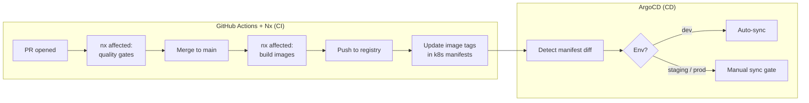
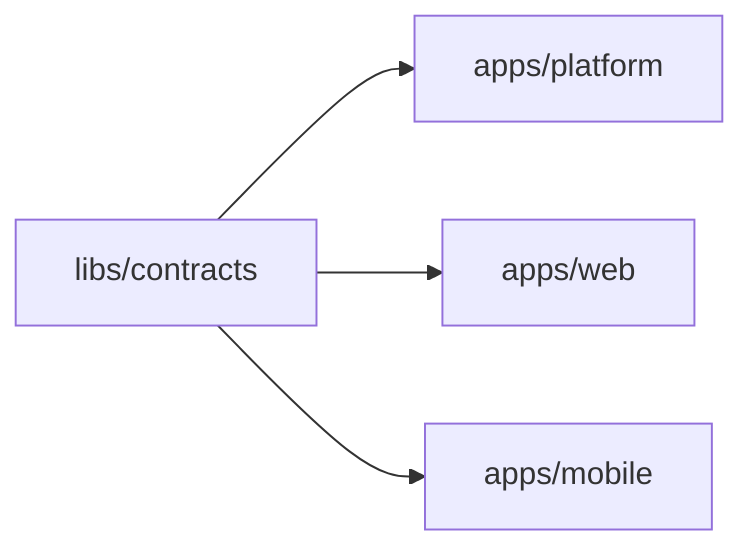
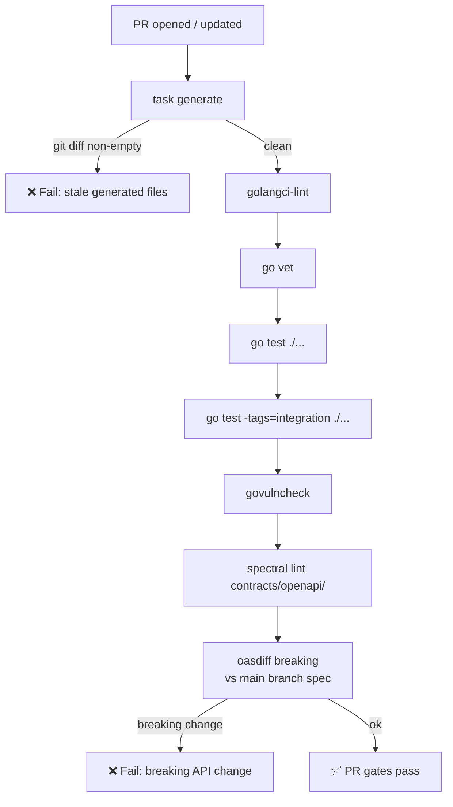
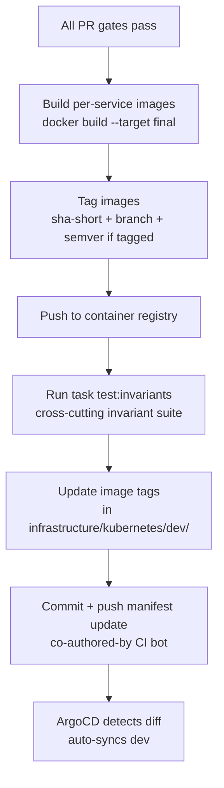
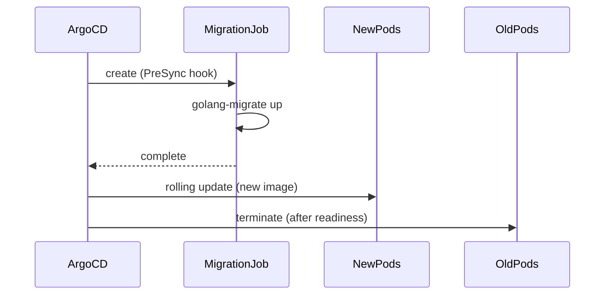
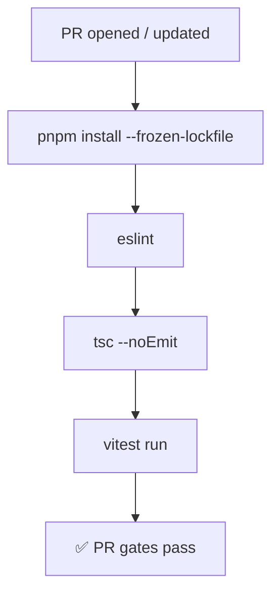
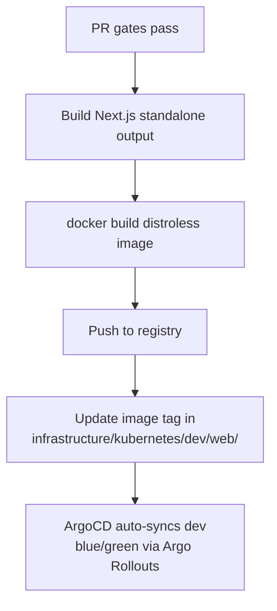
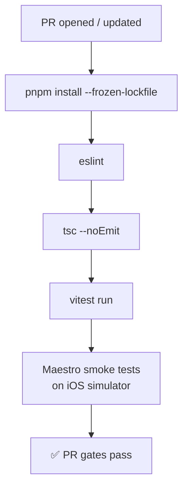
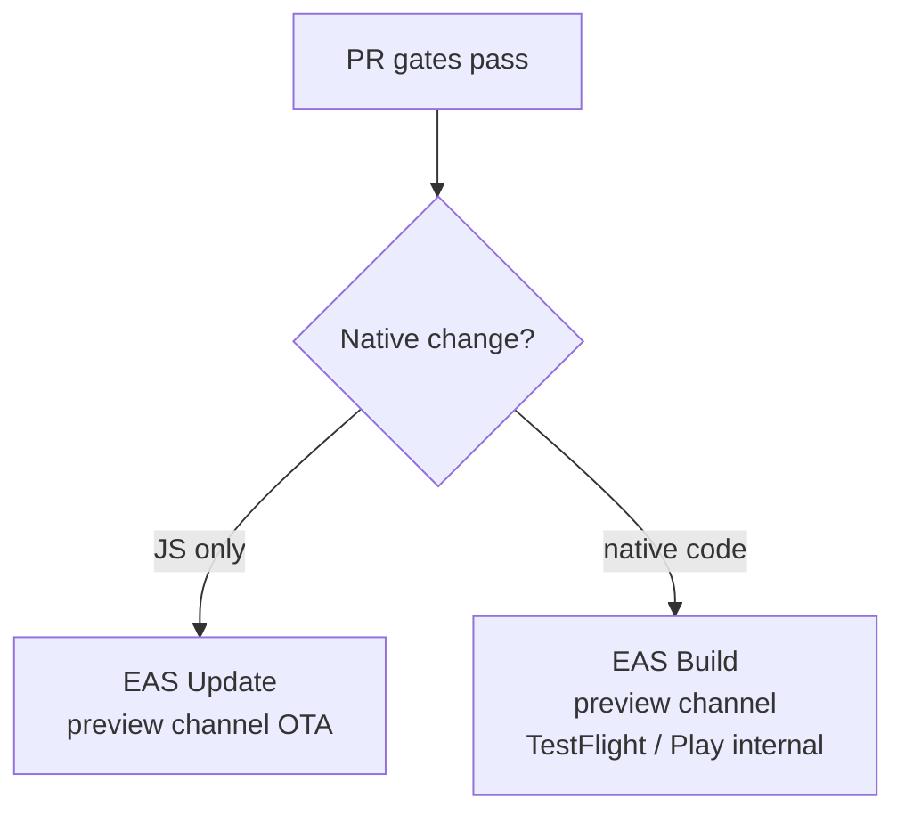
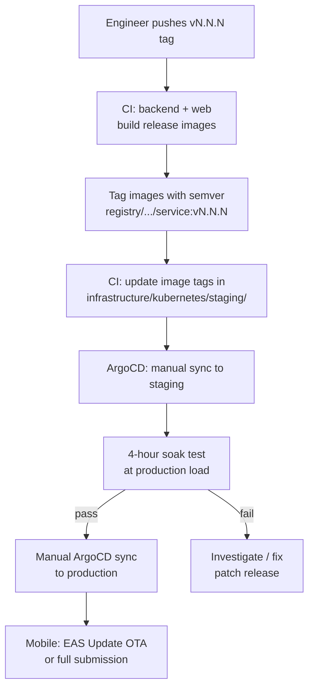

# 17 — CI/CD Pipelines (Deep Dive)

> End-to-end CI and CD design for all three trustC repos. Read this if you're implementing, debugging, or changing any pipeline. Sources: [14-tech-stack.md](./14-tech-stack.md), PRD §25, §55.

---

## System overview

trustC separates **CI** (GitHub Actions + Nx — build, verify, publish artifacts) from **CD** (ArgoCD — declarative GitOps sync to Kubernetes). The two systems handshake via a manifest update commit: CI pushes a new image tag into `infrastructure/kubernetes/`; ArgoCD detects the diff and reconciles the cluster.

All three workloads (`apps/platform`, `apps/web`, `apps/mobile`) live in the `trustc` monorepo. **Nx** drives affected-task detection — only the projects touched by a PR are built and tested. See [ADR 0006](../adr/0006-monorepo-and-nx-build.md) for the monorepo rationale.



**One monorepo, one CD system:**

| Nx project | CI runner | CD target |
| --- | --- | --- |
| `apps/platform` | GitHub Actions + Nx | ArgoCD → K8s (8 service images) |
| `apps/web` | GitHub Actions + Nx | ArgoCD → K8s (1 web image) |
| `apps/mobile` | GitHub Actions + Nx | EAS (iOS + Android) — ArgoCD not used for mobile |
| `libs/contracts` | GitHub Actions + Nx | npm publish (`@trustc/contracts`) |

## Nx affected detection

`nx affected` computes the project graph from `nx.json` and `project.json` files, then determines which projects are downstream of the changed files.



- A change to `apps/platform/services/ledger/` only affects `platform` — web and mobile CI is skipped.
- A change to `libs/contracts/openapi/` marks all four projects as affected — all run in parallel.
- CI command: `nx affected --target=lint,test,build --base=origin/main`

Remote cache (Nx Cloud or self-hosted) means a target whose inputs haven't changed since the last run is restored from cache rather than re-executed — critical for the Go integration test suite.

---

## Environments

| Environment | Trigger | Sync mode | Purpose |
| --- | --- | --- | --- |
| `dev` | Every merge to `main` | ArgoCD auto-sync | Integration testing, dogfood |
| `staging` | `vN.N.N` tag | ArgoCD manual sync | Pre-production validation, soak test |
| `production` | Manual ArgoCD sync after staging sign-off | ArgoCD manual sync | Live system |

Manifests for each environment live in isolated directories:

```
infrastructure/kubernetes/
├── dev/
│   ├── platform/        # per-service Deployments + Services
│   └── web/
├── staging/
│   ├── platform/
│   └── web/
└── production/
    ├── platform/
    └── web/
```

ArgoCD has one Application per `(repo, env)` pair, pointing at the corresponding directory. Promotion means updating the image tag in the next environment's directory and committing — there is no ArgoCD-level promotion API; git is the source of truth.

---

## CI — Backend (`apps/platform`)

### Per-PR pipeline



**Step details:**

| Step | Tool | What it checks | Failure means |
| --- | --- | --- | --- |
| `task generate` + diff | Wire, mockery, swag, oapi-codegen, sqlc | All generated files are up-to-date | A generated file was edited by hand or `task generate` was not run |
| `golangci-lint` | golangci-lint (`.golangci.yaml`) | Style, correctness, security linters | Linter violation; must fix before merge |
| `go vet` | stdlib | Suspicious constructs | Compiler-level issue |
| `go test ./...` | stdlib testing + rapid + ramsql | Unit tests, property-based invariants | Logic regression |
| `go test -tags=integration` | testcontainers-go | Services against real Postgres + NATS | Integration regression |
| `govulncheck` | govulncheck | Known CVEs in the dependency tree | Vulnerable dependency; must upgrade or accept |
| `spectral lint` | Spectral + ruleset | OpenAPI spec correctness and style | Malformed or non-compliant spec |
| `oasdiff breaking` | oasdiff | Breaking changes vs `main` branch spec | Client-breaking change without a new major version |

**Coverage gates** (enforced in `go test`):
- 80% line coverage overall
- 100% on `services/governance/internal/policies/` (policy aggregator)
- 100% on `internal/ledger/validator/` (ledger validator)

### On merge to `main`

Runs all PR steps, then:



**Image tagging convention:**

```
registry.example.com/trustc/<service>:<sha-short>
registry.example.com/trustc/<service>:main-<sha-short>
registry.example.com/trustc/<service>:<semver>   # only when a vN.N.N tag exists
```

The manifest update sets `image.tag` in the relevant Kubernetes Deployment. ArgoCD's auto-sync picks it up within its poll interval (default 3 min, configurable to webhook-push for sub-minute).

### Database migrations during deploy

Migrations run as a **Kubernetes Job** in a pre-sync ArgoCD hook, before any pod is replaced:



Rules:
- Migrations must be **backward-compatible** with the running (old) version — new columns are nullable or have defaults; columns are never renamed in one step.
- Ledger and audit table migrations require an explicit second reviewer and a replay test in CI before merge (see [06-ledger.md](./06-ledger.md#migration-safety)).
- Down migrations are provided but are not run automatically; rollback is a manual decision.

---

## CI — Web (`apps/web`)

### Per-PR pipeline



### On merge to `main`



**Blue/green deploy (web):**
- Argo Rollouts manages the web Deployment.
- A new `ReplicaSet` is created alongside the live one.
- Traffic is shifted 100% to the new set only after readiness probes pass.
- Automatic rollback fires if error rate exceeds threshold within the analysis window.

---

## CI — Mobile (`apps/mobile`)

### Per-PR pipeline



### On merge to `main`



Mobile does not go through ArgoCD — EAS handles its own delivery mechanism. The distinction between JS-only and native changes is determined by the presence of changes under `ios/`, `android/`, or `app.config.ts` in the diff.

---

## CD — ArgoCD GitOps flow

### Application structure

```
ArgoCD Applications
├── trustc-platform-dev      → infrastructure/kubernetes/dev/platform/    (auto-sync)
├── trustc-web-dev           → infrastructure/kubernetes/dev/web/          (auto-sync)
├── trustc-platform-staging  → infrastructure/kubernetes/staging/platform/ (manual)
├── trustc-web-staging       → infrastructure/kubernetes/staging/web/      (manual)
├── trustc-platform-prod     → infrastructure/kubernetes/production/platform/ (manual)
└── trustc-web-prod          → infrastructure/kubernetes/production/web/      (manual)
```

### Sync policies

| Environment | Sync mode | Self-heal | Prune |
| --- | --- | --- | --- |
| dev | Automated | Yes | Yes |
| staging | Manual | No | No |
| production | Manual | No | No |

Self-heal is disabled in staging and production: if someone applies a hotfix directly to the cluster, ArgoCD will not overwrite it until the next intentional sync.

### Rollback

Rollback in ArgoCD is a git operation:
1. Revert the image tag commit in `infrastructure/kubernetes/<env>/`.
2. Merge the revert.
3. ArgoCD detects the diff and syncs back (auto in dev; manual gate in staging/prod).

There is no ArgoCD "undo" button in production — all state changes go through git.

---

## Release pipeline (`vN.N.N` tag)



**Soak test (staging only):**
- Runs for 4 hours at production-level request rate.
- Checks: no p99 regressions against SLO targets (see [16-non-functional.md](./16-non-functional.md)), no error rate increase, no memory leaks.
- Gate is enforced in CI as a required status check on the tag pipeline; it must pass before the production manifest PR can be opened.

---

## Contract integrity gates (OpenAPI)

The OpenAPI specs in `contracts/openapi/` are the shared contract between backend, web, and mobile. Two CI gates protect them:

| Gate | Tool | Scope | Trigger |
| --- | --- | --- | --- |
| Spec lint | Spectral + custom ruleset | Style, correctness, required fields | Every PR touching `contracts/openapi/` |
| Breaking-change detection | oasdiff | Diff vs `main` branch spec | Every PR touching `contracts/openapi/` |

**What counts as breaking** (causes CI failure):
- Removing or renaming an endpoint
- Removing or renaming a required request field
- Changing a field type
- Removing an enum value
- Adding a required request field without a default

**How to ship a breaking change:** version the endpoint (`/v2/…`) and deprecate the old one. The old version stays until all consumers (web, mobile) have migrated. An ADR is required for any API version bump.

---

## Codegen integrity gate

`task generate` regenerates five artifacts. CI diffs the working tree after running it; any diff fails the build.

| Artifact | Generator | Why it must be clean |
| --- | --- | --- |
| `cmd/<svc>/wire_gen.go` | Google Wire | DI graph must match the declared providers |
| `services/<svc>/internal/mocks/` | mockery | Mocks must match current `biz` interfaces |
| `services/<svc>/docs/` | swag | Swagger UI must match current handlers |
| `internal/contracts/` | oapi-codegen | Go types must match the OpenAPI spec |
| `services/<svc>/internal/repo/query*.go` | sqlc | Query types must match SQL files |

---

## Secrets in pipelines

- Secrets are **never** baked into images or committed to manifests.
- CI uses GitHub Actions secrets for registry credentials and signing keys only.
- At runtime, pods read secrets from **AWS Secrets Manager / Vault** via the Kubernetes External Secrets operator; the manifest stores the secret reference path, not the value.
- The manifest update commit (image tag bump) never touches secret values.

---

## Load tests in CI

Each service ships a load test in `tests/load/<service>/`. They run:
- **On every merge to main** at 1× production target (smoke pass)
- **On every release tag** at 10× production target (capacity gate)
- **In the soak test** for 4 hours at 1× (stability gate)

Results are published as GitHub Actions workflow summaries and compared against baseline numbers stored in `tests/load/baselines.json`. A p99 regression of more than 20% over baseline fails the gate.

---

## Replay-based recovery test (CI)

The event replay runner in `tools/replay/` is exercised in CI on every merge to `main`:

1. Spin up a fresh Postgres instance via testcontainers.
2. Replay the event log fixture from `tests/fixtures/events/`.
3. Assert that the resulting projection state matches `tests/fixtures/expected-state.json`.

This verifies that the audit log remains a viable recovery mechanism after any code change. See [16-non-functional.md](./16-non-functional.md#replay-based-recovery).

---

## Summary: what fires when

| Event | Backend CI | Web CI | Mobile CI | ArgoCD |
| --- | --- | --- | --- | --- |
| PR opened / updated | Quality gates | Quality gates | Quality gates | — |
| Merge to `main` | Build + push + update dev manifests | Build + push + update dev manifests | EAS preview build | Auto-sync dev |
| `vN.N.N` tag | Build + push + update staging manifests | Same | EAS OTA or store submission | Manual sync staging → prod |
| Manual rollback | Revert manifest commit | Same | EAS rollback channel | Sync to reverted tag |

---

## See also

- [14-tech-stack.md](./14-tech-stack.md) — tooling choices and repo structure
- [16-non-functional.md](./16-non-functional.md) — SLOs, load targets, DR
- [06-ledger.md](./06-ledger.md#migration-safety) — ledger migration constraints
- [ADR 0005](../adr/0005-go-workspace-and-build.md) — Go module and Taskfile rationale
- [ADR 0006](../adr/0006-monorepo-and-nx-build.md) — monorepo consolidation and Nx rationale
