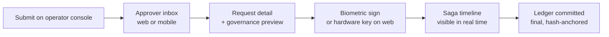

# 18 — UI Structure

> The shape of the client surfaces — who they're for, how they're organised, and the design language they share. This is a planning doc; no code lives in this repo. Sources: PRD §6, §9, §17, §32, §66, §155, §214; architecture docs [03](./03-services.md), [07](./07-treasury.md), [08](./08-workflow.md), [09](./09-governance.md), [11](./11-audit-observability.md), [12](./12-security.md), [14](./14-tech-stack.md).

trustC's clients are *instruments*, not consumer apps. The product's whole reason to exist is to make capital movement structurally rule-bound; the UI has to feel that way too. That is the lens for every choice below.

## Read this if you're…

- Scaffolding `trustc-web` or `trustc-mobile` for the first time
- Designing a screen that touches workflow, treasury, governance, escrow, or audit data
- Proposing a new persona-facing surface (it should land in the surface inventory below or motivate a new one via ADR)

---

## Surfaces

trustC ships **four** distinct client surfaces, all consuming the same gateway. They are separated by audience and density, not by data — the underlying APIs are uniform per [13-api-standards.md](./13-api-standards.md).

| Surface | Repo | Audience | Posture |
| --- | --- | --- | --- |
| **Operator Console** | `trustc-web` (`/(operator)`) | finance_operator, founder | Dense, ledger-like, multi-pane |
| **Investor Boardroom** | `trustc-web` (`/(investor)`) | investor | Editorial, generous, narrative |
| **Auditor Workbench** | `trustc-web` (`/(auditor)`) | auditor, compliance | Forensic, query-first, evidence-grade |
| **Approval Companion** | `trustc-mobile` | finance_operator, founder, investor (on the go) | Mobile-first, biometric, push-driven |

Two **secondary** surfaces share the web bundle but live behind their own route group:

| Surface | Route | Audience |
| --- | --- | --- |
| **Supplier Portal** | `trustc-web` (`/(supplier)`) | external supplier accounts |
| **Admin Console** | `trustc-web` (`/(admin)`) | admin (user management only — *not* a superuser surface, per PRD §58) |

There is **no** "all-in-one home page". The post-login router sends each actor to their primary surface based on their role claim. Cross-surface navigation is allowed only where the actor holds the matching role.

---

## Personas → surfaces

Roles are defined in [12-security.md](./12-security.md#roles-defaults). The default mapping:

| Role | Primary surface | Also has access to |
| --- | --- | --- |
| `finance_operator` | Operator Console | Approval Companion (mobile) |
| `founder` | Operator Console (Expense submission view) | Approval Companion |
| `investor` | Investor Boardroom | Approval Companion (high-value escalations) |
| `auditor` | Auditor Workbench | — (read-only by definition) |
| `supplier` | Supplier Portal | — |
| `employee` | Operator Console (`/expenses` only, scoped) | Approval Companion (own requests) |
| `admin` | Admin Console | — (no financial actions reachable) |

The router does **not** elevate. An employee whose JWT carries only `employee` does not see operator nav even if they typed the URL — the gateway returns 403 and the UI renders an "out of scope" empty state.

---

## Information architecture

### Operator Console (`trustc-web /(operator)`)

```
/                       → redirect to /workflow/inbox if approver, else /expenses/mine
/workflow/inbox         → approval queue (mine / team)
/workflow/expenses      → expense list + filters + new
/workflow/expenses/:id  → expense detail (FSM trail + approvals + governance decisions)
/workflow/definitions   → admin-of-workflow: definitions + versions
/treasury/wallets       → wallet segments table (operational/payroll/escrow/reserve/emergency)
/treasury/wallets/:id   → wallet detail: derived balance, fund-positions, ledger feed
/treasury/budgets       → budgets list (active / restricted / frozen / expired)
/treasury/budgets/:id   → budget detail: utilisation, allowed/forbidden receivers, drift alerts
/treasury/escrow        → escrow positions (Created / FundsLocked / AwaitingDelivery / …)
/treasury/escrow/:id    → escrow detail + condition + dispute thread
/governance/decisions   → recent decisions (allow / reject / escalate)
/governance/policies    → policy bundle list + version diff
/governance/alerts      → live alerts feed (liquidity, drift, velocity, integrity)
/notifications          → in-app notification inbox
```

The console is **multi-pane**: a left rail (nav), a primary list / canvas, and a right inspector that opens to show the *audit lineage* of whatever is selected. The inspector is the single feature that ties the console to its purpose — it's the same inspector everywhere, fed by the Audit query API.

### Investor Boardroom (`trustc-web /(investor)`)

The Boardroom is **read-projection-only**. It mounts CQRS read models per [Phase 8](./15-roadmap.md#phase-8--investor-dashboard--read-models-23-weeks) and never writes. Layout is editorial — a single wide column with marginal callouts, not a dashboard grid.

```
/                       → "Today" — runway, burn, cash position headline
/runway                 → cash runway projection (rules-based, not ML — explicitly v1)
/burn                   → burn rate by department / cost center
/budgets                → portfolio view of every org budget + utilisation
/positions              → wallet segments at a glance
/escrow                 → outstanding escrow positions and disputes
/governance             → policy posture: rejection rate, escalation rate, top rules firing
/freeze                 → emergency freeze trigger (multi-sig, time-bounded, audited)
```

The Investor Boardroom must support **investors holding stakes across multiple organisations**. Org switcher is in the top bar; switching the org reloads scope cleanly (RLS-backed; see [12-security.md](./12-security.md#multi-tenancy)).

### Auditor Workbench (`trustc-web /(auditor)`)

Built around the Audit service's query API ([11-audit-observability.md](./11-audit-observability.md#investigation-queries)). The workbench is *evidence-first* — every screen leads with hash-verifiable provenance, not summaries.

```
/                       → query builder (correlation, actor, time window, entity)
/correlation/:id        → full event chain for a correlation_id
/lineage/:txn_id        → tree view of a transaction's lineage
/actor/:id              → all events by an actor in a window
/integrity              → hash-chain verification status per organisation + on-demand re-verify
/snapshots              → signed snapshot manifests with download to write-once cold storage
/exports                → audited export jobs (every export is itself an audit event)
```

Critically, the Workbench **never edits**. There is no compose, no override, no "fix this row." If something is wrong, an investigator opens a remediation workflow in the Operator Console — they do not patch in the audit surface.

### Approval Companion (`trustc-mobile`)

Mobile is a single-purpose application: see what needs you, sign, and move on. Per PRD §32, biometric signing is required for approval submission.

```
(auth)                  → OIDC + PKCE login (expo-auth-session)
(tabs)/approvals        → queue of pending approvals (push-driven)
(tabs)/approvals/:id    → request detail + governance preview + biometric sign
(tabs)/expenses         → my submitted expenses (status follower)
(tabs)/expenses/new     → submit a new expense (lightweight)
(tabs)/notifications    → tap-through to the approvals or expense view
(tabs)/settings         → biometric prefs, signing-key rotation, sign-out
```

The mobile app does **not** mirror the Operator Console. It is intentionally narrow. If a flow can't be done in three taps, it belongs on the web surface.

### Supplier Portal (`trustc-web /(supplier)`)

Suppliers are *external* actors with their own RBAC scope ([12-security.md](./12-security.md#roles-defaults)). They never see operator surfaces.

```
/                       → my organisations (suppliers may serve multiple)
/invoices               → my invoices (uploaded vs. matched)
/invoices/new           → upload + classify (drives an expense workflow on the buyer side)
/escrow                 → my escrow positions (Created / AwaitingDelivery / Released / Refunded)
/escrow/:id             → submit delivery confirmation + documents
/disputes               → open disputes I'm party to
```

### Admin Console (`trustc-web /(admin)`)

Per [12-security.md](./12-security.md#identity--permissions), admins manage **identities and roles only** — they cannot touch financial state.

```
/users                  → users + role assignments + effective windows
/users/:id              → assignment history (append-only) + key rotation
/service-accounts       → service accounts + key rotation history
```

A common mistake to avoid in design: putting a "policy editor" or "wallet onboarding" tile on this surface. Both are *sensitive operations* under [12-security.md](./12-security.md#sensitive-operations) and live in Governance / Treasury surfaces with their own multi-sig flows, not on Admin.

---

## Critical UI flows

Every flow below is the user-facing rendering of a state machine that already exists in the architecture docs. The UI's job is to make the FSM visible, not to invent a new one.

### Submit → Approve → Pay (operator + companion)

Implements [08-workflow.md](./08-workflow.md#expense-request-state-machine).



Specific UI requirements:

- **Governance preview**, before signing, renders the current `decision` shape per [09-governance.md](./09-governance.md#decision-shape) — `allow`/`reject`/`escalate` with all `reasons[]`. Approvers do not sign blind.
- **Saga timeline** is a visible track of the seven workflow states ([08](./08-workflow.md#expense-request-state-machine)); the current state pulses, prior states are inert, future states are dimmed. Driven by Server-Sent Events from the gateway.
- **Idempotency-Key** is generated client-side on submit and persisted to local storage so a refresh during execution doesn't double-submit (see [13-api-standards.md](./13-api-standards.md#idempotency-semantics)).

### Escrow flow (operator + supplier)

Implements [10-escrow.md](./10-escrow.md#state-machine).

The escrow detail screen renders the same FSM diagram in Mermaid, with the current node highlighted. Disputes open a sidebar thread, *never* a modal — disputes are first-class entities and need a permanent home, not a transient overlay.

### Investigation (auditor)

Implements [11-audit-observability.md](./11-audit-observability.md#investigation-queries).

The query builder produces structured queries against the Audit API. Results are rendered as an event timeline (newest at top), each event expandable to show the canonical event payload, the `prev_hash`, and the verified-or-not chain status. Tampering attempts (the synthetic test from [Phase 1 demo](./15-roadmap.md#phase-1--ledger-mvp-23-weeks)) render as a broken-link icon between two events.

### Emergency freeze (investor)

Implements [09-governance.md](./09-governance.md#emergency-freeze) and [12-security.md](./12-security.md#sensitive-operations).

A freeze is **not** a button — it's a multi-sig workflow with a time bound. The Boardroom's `/freeze` route surfaces a request form; the actual freeze materialises only after a second signer acknowledges via the Approval Companion. The UI must show the freeze as an active object with a countdown until expiry, not as a state hidden in settings.

---

## Cross-cutting UI patterns

Patterns that recur across surfaces and must be implemented as shared components in `trustc-web/components/`. Shared types come from `@trustc/contracts` ([14-tech-stack.md](./14-tech-stack.md#cross-repo-contracts)).

| Pattern | Where it appears | Backed by |
| --- | --- | --- |
| **Audit lineage inspector** | Operator (right rail), Auditor (primary canvas), Investor (drill-down) | Audit query API |
| **Governance decision card** | Workflow detail, Approval Companion, Investor `/governance` | `GET /governance/decisions/:id/explanation` |
| **FSM track** | Workflow detail, Escrow detail, Treasury fund-position drawer | Local rendering of declared FSM + service event stream |
| **Hash-chain badge** | Auditor everywhere; Operator on ledger-derived rows | `GET /audit/integrity` per org |
| **Idempotency banner** | Any submit / approve / sign action | Client-generated key + 409 surface |
| **Multi-tenant org switcher** | Investor, Auditor, Supplier (when serving multiple orgs) | JWT `organization_id` claim swap |
| **Risk-score chip** | Workflow detail, governance feeds | `decision.risk_score` ramp (4 steps, never a gradient) |
| **Frozen-state lockout** | Operator (treasury, workflow) | `governance.freeze.triggered` event |
| **Error-envelope renderer** | All surfaces | Standard error shape from [13-api-standards.md](./13-api-standards.md#error) |

Two patterns deserve emphasis:

**The audit lineage inspector** is the single most-load-bearing component in the system. It is the user-facing manifestation of P5 ("All financial activity is traceable and immutable") from [01-principles.md](./01-principles.md#p5--all-financial-activity-is-traceable-and-immutable). Every screen that shows a financial entity must be able to open it for that entity. Build it once, and well.

**The governance decision card** is how `412 Precondition Failed` and `412 GOVERNANCE_REJECTED` ([13-api-standards.md](./13-api-standards.md#http-status-codes)) become legible to humans. It must surface the policy bundle version and every `reason` returned, never a single error message.

---

## Real-time model

| Surface | Channel | Why |
| --- | --- | --- |
| Operator Console | Server-Sent Events from gateway | One-way dashboard updates (saga progress, alerts); SSE is simpler than WS and survives proxies cleanly |
| Investor Boardroom | SSE for live tiles + polling for read projections | Read projections update on a 5s budget per [Phase 8 exit criteria](./15-roadmap.md#phase-8--investor-dashboard--read-models-23-weeks) |
| Auditor Workbench | None at the read layer (snapshot model); SSE only on `/integrity` | Investigations are pull, not push |
| Approval Companion | WebSockets to gateway + APNs/FCM push | Push wakes the app; WS keeps the queue live |

Both SSE and WS endpoints multiplex by `organization_id` and verify the JWT `organization_id` claim before subscribing. No surface ever subscribes to events outside its tenant scope.

---

## Approval signing UX

PRD §32 mandates biometric signing for approval submission on mobile. The web equivalent uses a hardware key (WebAuthn) for any approval above a per-org threshold; below that threshold, the session token suffices.

Constraints:

- The signing payload is exactly `(expense_request_id, step_index, decision, reason_hash, timestamp)` — see [08-workflow.md](./08-workflow.md#approval-signing). The UI shows each field in monospace before the user authorises, so the user sees what they are signing.
- The signing key for mobile is bound to the device via `expo-secure-store` (Keychain / Keystore, [14-tech-stack.md](./14-tech-stack.md#mobile-application)). Key rotation is a flow on `/settings`.
- A failed biometric does **not** silently retry; it surfaces and requires explicit re-attempt. We never sign on a "maybe."
- The signature is sent with the request; the server verifies before persisting. If verification fails, the UI renders the verification reason from the error envelope, not a generic "try again."

---

## Multi-tenancy in the UI

Every authenticated page is rendered in the context of exactly one `organization_id`. The org switcher is in the top bar on Investor / Auditor / Supplier surfaces (where actors typically span orgs); on Operator and Mobile, the org is fixed by the actor's role and is shown as a passive label.

Hard rules:

- The org context lives in the URL, not just in state. `/(investor)/runway?org=...` — bookmarking and sharing must be unambiguous.
- Switching org tears down all in-memory caches (TanStack Query cache reset). Cross-tenant ghosting is a security defect, not a UX wart.
- An actor whose role on the new org is missing or expired sees an explicit "no access" state, not an empty dashboard. Empty states must be unambiguous about *why* they are empty.

---

## Design language

trustC's product identity is structural enforcement of capital integrity. The UI must look like an instrument, not a consumer fintech app. The visual language is **Editorial Trading Terminal** — Bloomberg-adjacent density on operator surfaces, broadsheet-editorial restraint on investor surfaces, both anchored in typography, not chrome.

### Typography

| Role | Choice | Open fallback | Where |
| --- | --- | --- | --- |
| Display (boardroom, investor headlines) | *GT Sectra* or *Tiempos Headline* | *Source Serif 4* | Investor surface, marketing-adjacent screens |
| Body sans | *Söhne* or *Untitled Sans* | *IBM Plex Sans* | Default for all UI text on operator surfaces |
| Monospace | *JetBrains Mono* | *IBM Plex Mono* | Amounts, IDs, hashes, correlation IDs, signing payloads |

Hard rules on numerals:

- **Tabular lining figures, always**, in any column showing amounts, dates, IDs, or balances. Old-style figures only in narrative copy (governance reason text, dispute threads).
- Currency symbol is in the column header, not repeated per row.
- Hashes and correlation IDs are truncated with a copy-on-click affordance and full-value tooltip — never just truncated.

Avoid: Inter, Roboto, system stacks, and the "tech-startup neutral sans" lineage. They will land in this product as cliché.

### Colour

A restrained palette anchored in two surface modes:

| Token | Operator (paper) | Investor (boardroom) | Use |
| --- | --- | --- | --- |
| Surface | `#F6F1E8` (warm rag) | `#0E0E10` (deep ink) | Page background |
| Ink | `#16161A` | `#EFEAD8` | Primary text |
| Rule | `#1F1F22` at 12% | `#EFEAD8` at 14% | Borders, separators |
| Allow / committed | `#1E5435` (ink-green) | `#9DCAA1` | Allowed governance, committed ledger |
| Reject / frozen | `#A6261C` (ledger-red) | `#E07268` | Rejected, frozen, integrity break |
| Escalate | `#8A6A1F` (oxide) | `#D7B26B` | Governance escalations |
| Risk ramp | 4-step (`#E5E0D0` → `#A6261C`) | matched 4-step on dark | Risk score chip |

Hard rules:

- **No gradients**, anywhere. Risk score, runway, utilisation — all four-step ramps with declared thresholds.
- Status colours are never the only signal — every coloured chip carries a label or icon. Accessible by default, not as a retrofit.
- Reject / frozen colours are reserved for those states. Do not borrow them for "destructive" UI like "delete user" — admin destructive actions get their own muted treatment.

### Density

Operator surfaces are dense — Bloomberg-adjacent. Investor surfaces are the opposite: an editorial broadsheet with generous margins and one column of focus per scroll. Auditor surfaces are dense but slower — fewer rows per screen, more context per row, because forensics is read-heavy. Mobile is single-column with the biometric drawer pinned.

### Motion

Minimal and purposeful:

- **FSM track** advances left-to-right as state changes — the only animated journey on the page.
- **Hash-chain integrity** verification animates a "stitch" — a thin line that walks across the verified range. If the chain breaks, the stitch stops and reddens at the break point. Never decorative.
- **Saga timeline** for an in-flight workflow pulses the active node only.
- Page transitions are static. No fade-in dashboards, no skeleton shimmer for read-projection tiles — show the cached value with a small "as of …" subscript, then update in place.

### Empty, error, and "frozen" states

Every list view and detail view ships with three explicit states beyond the data state:

- **Empty** — explains *why* (no requests, no decisions, no escrow), not just "nothing here."
- **Error** — renders the [error envelope](./13-api-standards.md#error) verbatim, with the `error.code` shown for support reproduction. We do not invent friendlier copy that hides the code.
- **Frozen** — when the org or wallet is under emergency freeze, every write affordance disables and the page banners the freeze with a countdown to expiry and a link to the freeze decision in the audit log.

---

## Data fetching & state model

Both web and mobile use **TanStack Query** ([14-tech-stack.md](./14-tech-stack.md)) against the gateway, with the generated client from `@trustc/contracts`.

| Concern | Approach |
| --- | --- |
| Read caching | TanStack Query keys include `organization_id` so org switch invalidates cleanly |
| Optimistic updates | Allowed for cosmetic state (notification read, filter prefs); **forbidden** for financial state — every write waits for the server's response |
| Real-time | SSE (web) / WS (mobile) feed event handlers that invalidate the relevant query keys |
| Idempotency | A small wrapper around the generated client adds `Idempotency-Key` per logical action; keys persist to local storage until success |
| Error mapping | A single `ApiError` class wraps the [error envelope](./13-api-standards.md#error); UIs render `error.code` consistently via the error-envelope renderer |
| Pagination | Cursor only — never offset. `useInfiniteQuery` against the cursor field |

State layering:

- **URL** — primary state for filters, ranges, selected entity, org context
- **TanStack Query** — server state (read projections, lists, details)
- **Zustand** (light) — ephemeral UI state (right-rail open/closed, draft form values)
- **Local storage** — idempotency keys, last-used filters per surface

There is **no Redux, no MobX, no global event bus on the client**. The server is the source of truth, and the event stream pushes invalidations.

---

## Component architecture

Per [14-tech-stack.md](./14-tech-stack.md#web-application), the web app uses Radix + Tailwind via shadcn/ui and the mobile app uses Expo-friendly equivalents. Conventions for this repo's future implementation:

- `components/primitives/` — Radix-wrapped primitives (button, dialog, tooltip, popover) themed once, used everywhere.
- `components/financial/` — domain components that *only* exist in trustC (FSM track, decision card, lineage inspector, hash-chain badge, risk chip, money cell). Every component in this directory has a single source-of-truth API contract from `@trustc/contracts`.
- `components/layout/` — shells per route group (operator three-pane, investor editorial, auditor workbench, supplier portal).
- `lib/api/` — generated client + `ApiError` + idempotency wrapper.
- `lib/realtime/` — SSE / WS adapters; both call the same `invalidate()` surface so query invalidation is uniform.

`components/financial/` is the place where Bloomberg-density meets explicit invariants. Its components must:

1. Render only from typed contracts (no `any`).
2. Expose the underlying event or decision via the lineage inspector (every financial component is "explainable" in the audit sense).
3. Have visual regression tests, because subtle mis-renders of money are a financial integrity issue.

---

## Accessibility & internationalisation

- **Accessibility**: WCAG 2.2 AA at minimum. Status colour is never the only signal. Tabular-figure number columns are screen-readable in row order. The Approval Companion's biometric prompt has a screen-reader-friendly label that names what is being signed.
- **Internationalisation**: copy lives in a translation layer from day one (`next-intl` for web, `expo-localization` + `i18next` for mobile). Number, date, and currency formatting uses the platform `Intl` APIs with explicit locale, not implicit user locale, to avoid silently rendering an org's numbers in a viewer's locale.
- **Currency**: amounts always render with currency code, never just a symbol. Cross-currency views never imply an FX conversion the system did not perform — explicit FX events are required per [01-principles.md](./01-principles.md#forbidden-patterns).

---

## Roadmap alignment

UI workstreams attach to backend phases per [15-roadmap.md](./15-roadmap.md):

| Backend phase | Web (operator + supplier) | Web (investor + auditor) | Mobile |
| --- | --- | --- | --- |
| 0 — Foundation | Auth shell, layout primitives, generated client | — | Auth shell |
| 1 — Ledger MVP | — (no user-facing ledger writes yet) | — | — |
| 2 — Treasury MVP | Read-only wallet / budget views | — | — |
| 3 — Workflow Engine *(first user-visible)* | Operator Console v1 (workflow + treasury) | — | Approval Companion v1 (queue + sign) |
| 4 — Governance Engine | Decision cards + alerts feed | — | Governance preview before sign |
| 5 — Escrow | Escrow surfaces, Supplier Portal v1 | — | — |
| 6 — Audit & Observability | Lineage inspector | Auditor Workbench v1 | — |
| 7 — Notification | Notification inbox | Notification rendering | Push notifications, deep links |
| 8 — Investor Dashboard / Read Models | — | Investor Boardroom v1 | — |

The Operator Console **must not** ship before Phase 3 — earlier phases have nothing for an operator to do. The mobile app must not ship before Phase 4 — without governance, the Approval Companion would let approvers sign blind, which is a violation of the product's reason to exist.

---

## Open questions (likely future ADRs)

These are decisions that close off other reasonable options and should land as ADRs before the matching surface ships:

| Question | Why it's an ADR candidate |
| --- | --- |
| WebAuthn / hardware key for web approval signing vs. session-token-only | Closes off whether the web surface ever signs financial actions itself |
| In-app notifications via SSE-pushed inbox vs. polling Notification API | Affects gateway fan-out shape and Notification service contract |
| Real-time stream multiplexing — one SSE channel per actor vs. per resource subscription | Affects gateway architecture and replay semantics |
| Investor Boardroom rendering server-component-first vs. client-rendered with TanStack only | Affects SSR / streaming design and how read projections are exposed |
| Supplier authentication — separate IdP tenant vs. shared with org | Has security and onboarding implications |

None of these block the current architecture; all should be decided before the matching phase exits.

---

## Out of scope for v1

- **Public investor / marketing site.** Out of repo scope; lives in its own marketing surface when one exists.
- **A "trustC mobile for suppliers".** Suppliers use the Supplier Portal on web; mobile is approver-only.
- **AI assistant / chat in the UI.** PRD §16, §35, §187, §206 are explicitly out of v1 scope per [15-roadmap.md](./15-roadmap.md#explicitly-out-of-scope-for-v1).
- **Embeddable widgets / iFrames for partner sites.** Not on the v1 surface map.
- **Drag-and-drop policy editor.** Policies are authored as YAML / JSON via the `tools/policy-cli/` CLI ([14-tech-stack.md](./14-tech-stack.md#backend-repository-structure-trustc-platform)) until usage justifies a visual builder.

---

## See also

- [03-services.md](./03-services.md) — the APIs each surface consumes
- [08-workflow.md](./08-workflow.md), [09-governance.md](./09-governance.md), [10-escrow.md](./10-escrow.md) — FSMs the UI renders
- [11-audit-observability.md](./11-audit-observability.md) — the read paths the Auditor Workbench is built on
- [12-security.md](./12-security.md) — RBAC and multi-tenancy enforcement that gates every surface
- [13-api-standards.md](./13-api-standards.md) — the envelope every UI renders
- [14-tech-stack.md](./14-tech-stack.md) — the web and mobile stacks this doc plans for
- [15-roadmap.md](./15-roadmap.md) — the phasing UI work attaches to
