I’ve created a full production-grade architecture document covering:

* smart-contract escrow architecture
* milestone settlement logic# Product Requirements Document (PRD)

## trustC — Programmable Financial Operating System

Version: 1.0
Audience: AI Engineering Systems (Claude Code), Backend Engineers, System Architects, Infrastructure Engineers

---

# 1. Product Vision

trustC is a programmable financial operating system designed to enforce real-time capital governance across operational workflows.

The system eliminates the gap between:

* operational execution
* treasury control
* accounting
* investor oversight

Unlike traditional accounting systems, trustC prevents unauthorized capital movement at the infrastructure layer.

Core philosophy:

* money cannot move without operational context
* governance is enforced programmatically
* accounting is generated automatically from events
* treasury access is isolated from operational actors
* all financial activity is traceable and immutable

---

# 2. Core Problem Statement

Traditional financial systems suffer from:

* delayed accounting visibility
* manual bookkeeping errors
* unauthorized fund allocation
* lack of investor transparency
* weak auditability
* agency conflicts between investors and operators

trustC solves this through:

* programmable treasury controls
* real-time ledger generation
* policy-driven workflows
* immutable audit trails
* operationally-linked payments

---

# 3. Product Scope

## Included

* treasury management
* workflow-controlled payments
* escrow system
* real-time accounting ledger
* budget governance
* approval workflows
* investor visibility dashboards
* payroll isolation
* supplier payment validation
* anomaly detection infrastructure
* audit logging

## Excluded

* retail banking
* cryptocurrency exchange
* public blockchain
* consumer payment gateway
* tax filing automation

---

# 4. High-Level Architecture

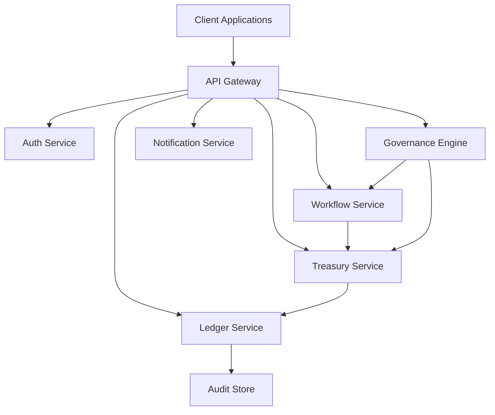

---

# 5. Architecture Principles

## Mandatory Principles

### 5.1 Append-Only Ledger

Ledger entries are immutable.

No updates.
No deletes.

Only compensating entries allowed.

---

### 5.2 Event-Driven Architecture

All financial state transitions must originate from events.

---

### 5.3 Policy Enforcement

No transaction may bypass governance rules.

---

### 5.4 Operational Context Requirement

Every financial transaction must contain:

* actor
* workflow reference
* business justification
* operational reference

---

### 5.5 Treasury Isolation

Operational actors never directly control treasury balances.

---

# 6. Core Services

---

## 6.1 Auth Service

Responsibilities:

* authentication
* authorization
* role management
* session management

Roles:

* investor
* founder
* finance_operator
* supplier
* employee
* auditor

---

## 6.2 Workflow Service

Responsibilities:

* expense request lifecycle
* approval chains
* workflow orchestration
* state transitions

States:

```text
draft
submitted
under_review
approved
rejected
executed
cancelled
```

---

## 6.3 Treasury Service

Responsibilities:

* fund allocation
* escrow locking
* payment execution
* wallet isolation

Rules:

* no direct balance mutation
* all balance changes require events

---

## 6.4 Ledger Service

Responsibilities:

* double-entry accounting
* immutable ledger entries
* audit-safe financial history

Requirements:

* append-only
* idempotent writes
* transaction integrity

---

## 6.5 Governance Engine

Responsibilities:

* policy validation
* budget enforcement
* anomaly detection hooks

Example policies:

* payroll funds cannot pay vendors
* escrow requires delivery confirmation
* budget thresholds cannot be exceeded

---

# 7. Core Domain Models

---

## Organization

```text
id
name
type
created_at
```

---

## Wallet

```text
id
organization_id
wallet_type
currency
status
```

---

## Budget

```text
id
wallet_id
budget_type
allocated_amount
remaining_amount
```

---

## ExpenseRequest

```text
id
organization_id
requestor_id
amount
purpose
status
workflow_id
```

---

## LedgerEntry

```text
id
transaction_id
account_id
debit
credit
timestamp
immutable_hash
```

---

## EscrowAccount

```text
id
supplier_id
locked_amount
status
release_condition
```

---

# 8. Financial Invariants

These rules MUST NEVER be violated.

---

## Ledger Invariants

* total debits == total credits
* ledger entries immutable
* no orphan ledger entries

---

## Treasury Invariants

* locked escrow funds cannot be spent
* treasury balance cannot become negative

---

## Governance Invariants

* rejected workflows cannot execute payments
* unauthorized actors cannot approve transactions

---

# 9. User Flows

---

## 9.1 Expense Request Flow

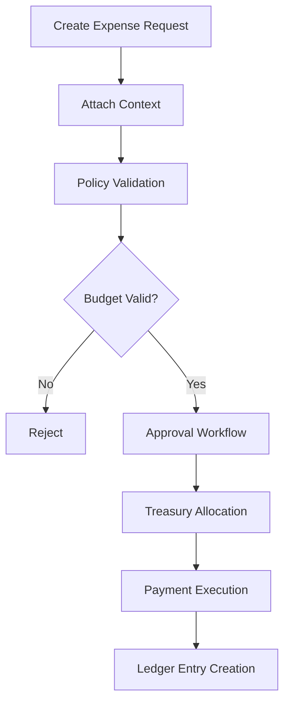

---

## 9.2 Escrow Flow

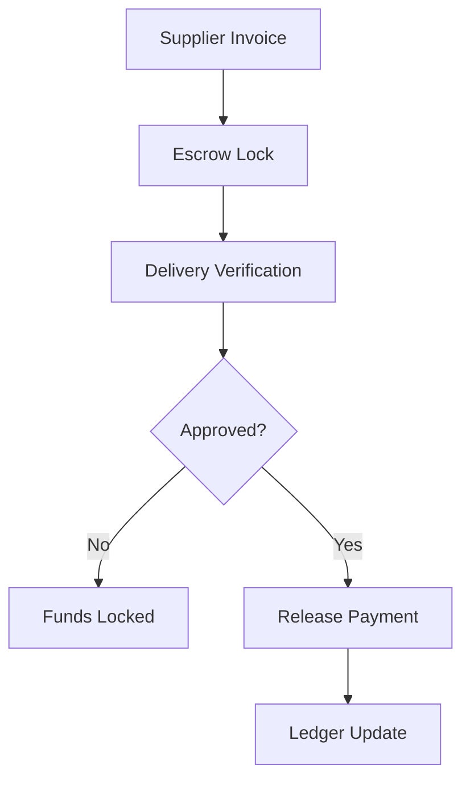

---

## 9.3 Payroll Flow

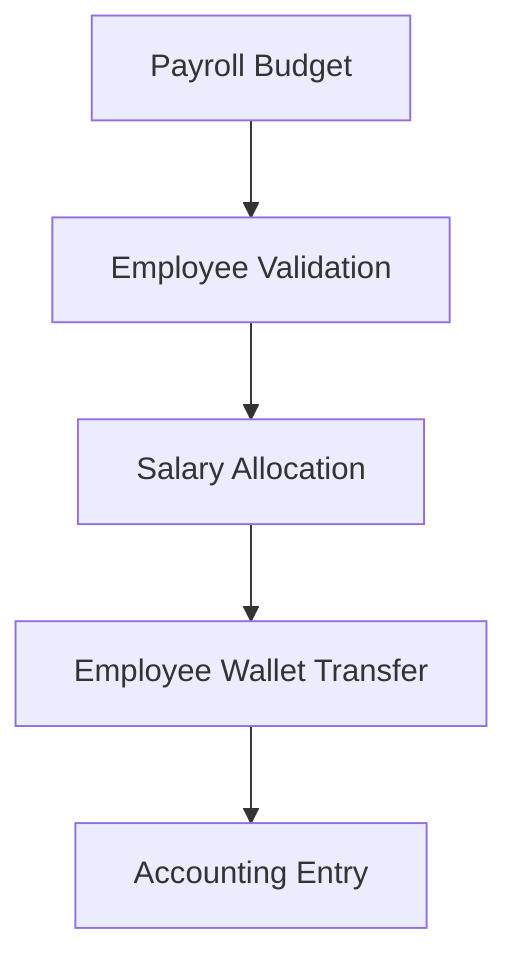

---

# 10. API Requirements

---

## Expense APIs

### Create Expense Request

```http
POST /expenses
```

---

### Approve Expense

```http
POST /expenses/{id}/approve
```

---

### Reject Expense

```http
POST /expenses/{id}/reject
```

---

## Treasury APIs

### Allocate Funds

```http
POST /treasury/allocate
```

---

### Release Escrow

```http
POST /escrow/release
```

---

# 11. Security Requirements

---

## Mandatory

* RBAC enforcement
* immutable audit logs
* signed event history
* transaction traceability
* idempotent operations

---

## Forbidden

* hard deletes
* silent balance mutations
* direct SQL financial edits

---

# 12. Audit Requirements

Every action must contain:

```text
actor_id
timestamp
source_ip
workflow_reference
event_signature
```

---

# 13. Scalability Requirements

System must support:

* 1M ledger entries/day
* distributed services
* retry-safe event processing
* eventual consistency where appropriate

---

# 14. Failure Handling

System must support:

* retryable workflows
* dead-letter queues
* event replay
* rollback via compensating entries

---

# 15. Observability

Required telemetry:

* transaction tracing
* workflow tracing
* policy rejection metrics
* treasury flow analytics

---

# 16. AI Governance Roadmap

Future capabilities:

* anomaly detection
* predictive burn analysis
* suspicious payment detection
* automated governance recommendations

---

# 17. Engineering Constraints

Claude Code MUST follow:

* clean architecture
* domain-driven design
* event-driven patterns
* immutable financial records
* strict separation of concerns

---

# 18. Development Strategy

Development must happen incrementally.

Order:

1. Ledger Service
2. Treasury Service
3. Workflow Engine
4. Governance Engine
5. Escrow System
6. Audit Infrastructure
7. Monitoring Layer

---

# 19. Mandatory Engineering Reviews

After each module implementation Claude Code must:

* identify security risks
* identify concurrency risks
* identify accounting inconsistencies
* identify invariant violations
* identify scaling bottlenecks

---

# 20. Final Objective

Build a programmable financial governance infrastructure where:

* capital movement is controlled
* accounting is automatic
* treasury is protected
* investor visibility is real-time
* governance is enforced by system architecture, not human trust

* Chainlink oracle integrations
* Kleros decentralized arbitration
* hybrid fiat + crypto settlement rails
* liquidity pool infrastructure
* treasury and reserve management
* browser workflow systems
* customs and logistics integrations
* insurance workflows
* security and compliance architecture
* on-chain vs off-chain tradeoffs
* full enterprise system architecture diagram
* trustless marketplace execution model
* performance guarantee collateral systems
* operational scalability considerations

It’s structured as a professional enterprise architecture specification suitable for platform planning, technical design reviews, investor presentations, or engineering implementation planning.

# 21. State Machines

All critical workflows MUST be modeled as deterministic state machines.

No hidden transitions allowed.

---

## 21.1 Expense Request State Machine

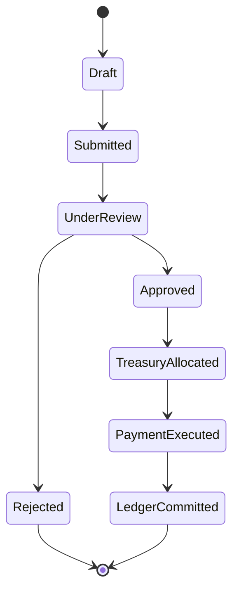

### Rules

* rejected requests cannot return to approved
* executed payments cannot be modified
* ledger commit is final

---

## 21.2 Escrow State Machine

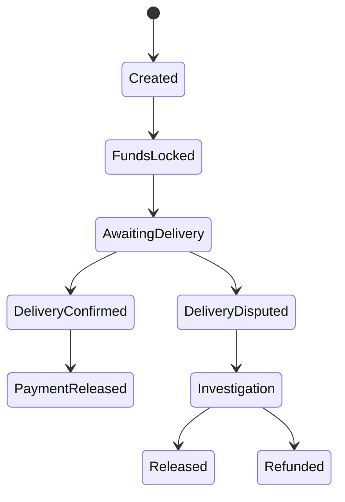

### Constraints

* locked funds cannot be reused
* release requires confirmation event
* refund requires audit record

---

## 21.3 Payroll State Machine

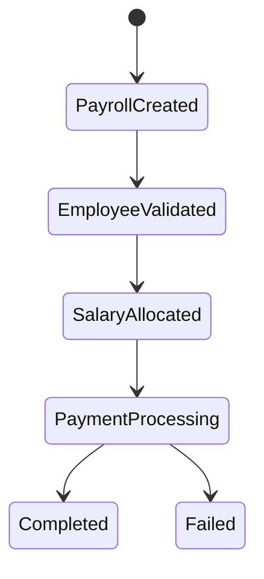

---

# 22. Event Taxonomy

All system behavior must be event-driven.

---

## 22.1 Financial Events

```text id="cxef6v"
ExpenseRequested
ExpenseApproved
ExpenseRejected

FundsAllocated
FundsLocked
FundsReleased

PaymentExecuted

LedgerEntryCreated

EscrowCreated
EscrowReleased
EscrowRefunded

PayrollAllocated
SalaryTransferred
```

---

## 22.2 Governance Events

```text id="y0d79h"
PolicyViolationDetected
BudgetThresholdExceeded
SuspiciousTransactionDetected
UnauthorizedAccessAttempt
```

---

## 22.3 Audit Events

```text id="7eu9t9"
ActorAuthenticated
WorkflowModified
ApprovalGranted
ApprovalRejected
```

---

# 23. Event Contract Standards

Every event MUST contain:

```json
{
  "event_id": "uuid",
  "event_type": "string",
  "timestamp": "ISO8601",
  "actor_id": "uuid",
  "organization_id": "uuid",
  "correlation_id": "uuid",
  "payload": {},
  "signature": "hash"
}
```

---

# 24. Database Design Requirements

---

## 24.1 Ledger Database Rules

Forbidden:

* UPDATE ledger_entries
* DELETE ledger_entries

Allowed:

* INSERT only

---

## 24.2 Audit Tables

All audit tables must be append-only.

---

## 24.3 Soft Delete Strategy

Operational entities may use:

```text id="p0t4f3"
deleted_at
archived_at
```

But NEVER for financial records.

---

# 25. Recommended Tech Stack

Claude Code should optimize for reliability and auditability.

---

## Backend

```text id="yqez1s"
Node.js
TypeScript
NestJS
```

---

## Database

```text id="r4fwnn"
PostgreSQL
Redis
```

---

## Messaging

```text id="i9l0nd"
Kafka
or
NATS
```

---

## Infrastructure

```text id="d9o18g"
Docker
Kubernetes
Terraform
```

---

# 26. Folder Structure Standard

```text id="6q4xuq"
src/

domains/
  treasury/
  ledger/
  workflows/
  governance/

application/

infrastructure/

shared/

events/

policies/

audit/
```

---

# 27. Ledger Design Specification

This is the most critical subsystem.

---

## Requirements

* double-entry accounting
* immutable
* deterministic
* replay-safe

---

## Ledger Transaction Example

```json
{
  "transaction_id": "txn_001",
  "entries": [
    {
      "account": "cash",
      "debit": 1000,
      "credit": 0
    },
    {
      "account": "marketing_expense",
      "debit": 0,
      "credit": 1000
    }
  ]
}
```

---

## Validation Rules

* sum(debits) == sum(credits)
* no empty transactions
* transaction must contain context reference

---

# 28. Treasury Architecture

Treasury is NOT a wallet app.

Treasury is a governance-controlled capital routing system.

---

## Treasury Responsibilities

* allocation
* locking
* release control
* spending isolation

---

## Treasury Flow

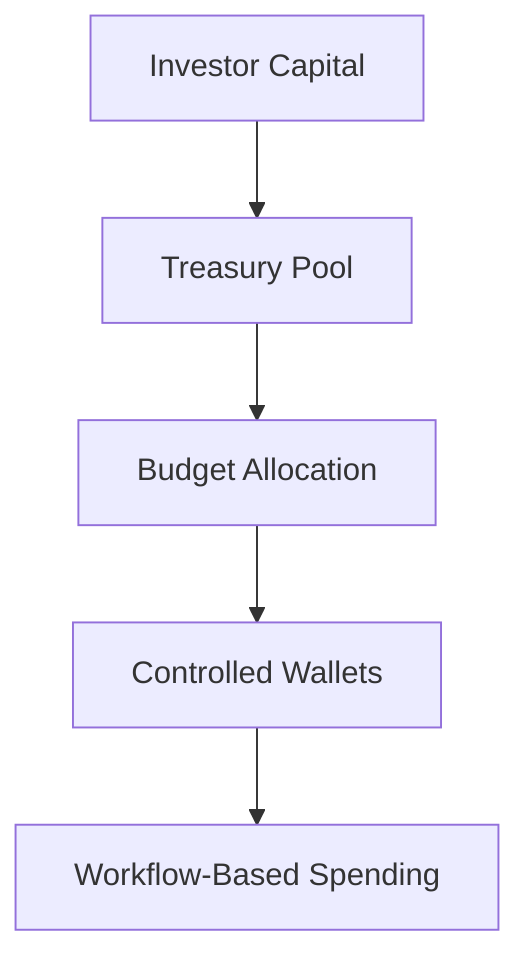

---

# 29. Governance Engine Specification

The governance engine validates all financial actions.

---

## Example Rule

```yaml
rule: payroll_only_for_employees

conditions:
  - wallet_type == payroll
  - receiver_type == employee

action:
  allow
```

---

## Example Rejection

```yaml
rule: reject_unapproved_supplier

conditions:
  - supplier.approved == false

action:
  reject
```

---

# 30. Escrow Architecture

Escrow is a controlled release mechanism.

---

## Escrow Requirements

* funds isolated
* conditional release
* audit trail mandatory

---

## Escrow Flow Logic

```text id="x32d3m"
lock funds
wait for verification
release or refund
generate ledger events
```

---

# 31. Concurrency Requirements

Financial systems MUST be concurrency-safe.

---

## Requirements

* idempotent event processing
* optimistic locking
* transaction isolation
* duplicate event prevention

---

## Forbidden

* race-condition-based balance updates

---

# 32. Threat Model

Claude Code must continuously evaluate threats.

---

## Threats

### Internal Fraud

Example:

* fake invoices
* unauthorized approvals

---

### Workflow Bypass

Example:

* direct treasury mutation

---

### Ledger Corruption

Example:

* modifying accounting history

---

### Replay Attacks

Example:

* duplicate payment execution

---

# 33. Required Defensive Controls

---

## Transaction Idempotency

All financial operations require idempotency keys.

---

## Approval Signatures

Critical approvals require signed approval records.

---

## Immutable Audit Logs

No deletions permitted.

---

# 34. Observability Architecture

---

## Metrics

```text id="i8wvf0"
failed_payments
policy_rejections
burn_rate
approval_latency
escrow_lock_duration
```

---

## Tracing

Every request must support:

```text id="7c90wk"
trace_id
correlation_id
event_chain
```

---

# 35. AI Governance Future Layer

Future autonomous governance layer.

---

## Capabilities

* detect abnormal spending
* predict runway exhaustion
* identify suspicious vendors
* recommend budget optimizations

---

## Example AI Flow

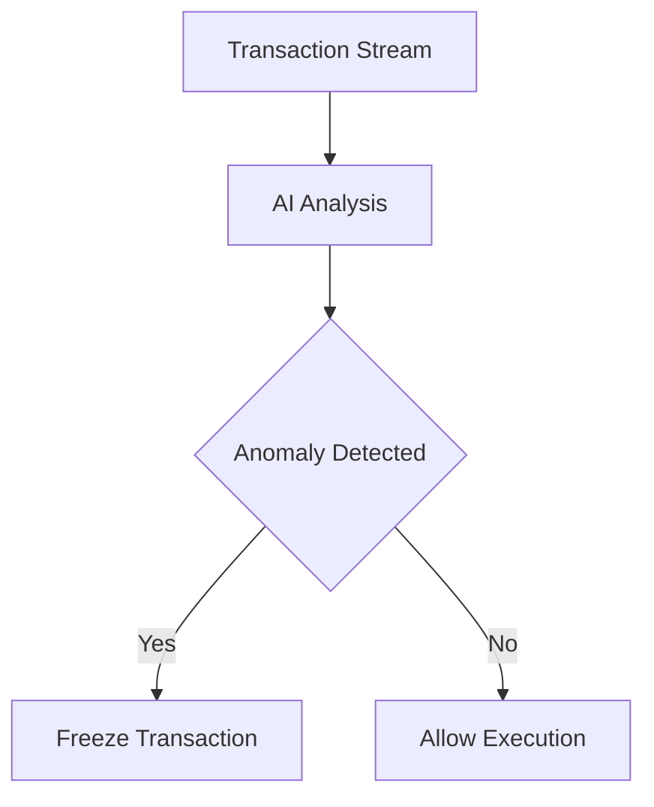

---

# 36. Testing Requirements

Claude Code must generate:

---

## Unit Tests

For:

* policy validation
* ledger balancing
* workflow transitions

---

## Integration Tests

For:

* payment flows
* escrow release
* treasury allocation

---

## Invariant Tests

Critical.

Example:

```text id="xq0f1s"
ledger must always balance
```

---

# 37. CI/CD Requirements

---

## Mandatory Checks

Before deployment:

* invariant validation
* migration validation
* event schema validation

---

# 38. Migration Rules

Financial migrations are high risk.

---

## Rules

* migrations reversible
* no destructive ledger migrations
* audit compatibility maintained

---

# 39. Engineering Philosophy

Claude Code must behave like a financial infrastructure engineer.

Not like a CRUD app generator.

Priority order:

1. integrity
2. auditability
3. determinism
4. security
5. scalability
6. developer convenience

---

# 40. Master Instruction for Claude Code

Use this as persistent instruction:

You are building a programmable financial operating system.

This is critical financial infrastructure.

Never prioritize speed over integrity.

All financial actions must be:

* traceable
* immutable
* auditable
* policy-controlled

Never allow direct balance mutation.

Always think about:

* fraud prevention
* concurrency safety
* auditability
* invariant protection
* event consistency

Before implementing any feature:

* identify edge cases
* identify attack vectors
* identify accounting risks
* identify race conditions

You are not building a CRUD SaaS app.

You are building financial governance infrastructure.

# 41. API Design Standards

All APIs must be deterministic, traceable, and safe for financial operations.

---

## 41.1 API Principles

### Forbidden

* implicit mutations
* silent failures
* hidden side effects

---

### Required

* idempotency support
* audit metadata
* traceability
* explicit status transitions

---

## 41.2 Required Headers

```http id="j7m5py"
X-Request-ID
X-Correlation-ID
X-Actor-ID
Idempotency-Key
```

---

## 41.3 Standard API Response

```json id="9m1v65"
{
  "success": true,
  "data": {},
  "trace_id": "uuid",
  "timestamp": "ISO8601"
}
```

---

# 42. Workflow Engine Deep Specification

The workflow engine orchestrates operational approvals.

This is NOT a simple approval table.

It is a deterministic orchestration engine.

---

## Workflow Components

```text id="xpk2mv"
workflow_definition
workflow_instance
approval_step
transition_rule
approval_actor
rejection_reason
execution_state
```

---

## Example Workflow

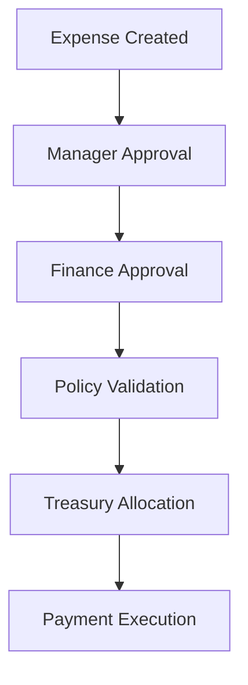

---

## Workflow Rules

* steps cannot be skipped
* approval chain immutable after submission
* rejected workflows require new submission

---

# 43. Budget Governance Model

Budgets are controlled allocation containers.

Not balances.

---

## Budget Types

```text id="e8rq5m"
marketing
payroll
operations
procurement
vendor_payments
emergency
```

---

## Budget Constraints

Example:

```yaml id="lb29pd"
budget_type: payroll

allowed_receivers:
  - employees

forbidden_receivers:
  - vendors
  - suppliers
```

---

## Budget Exhaustion Rules

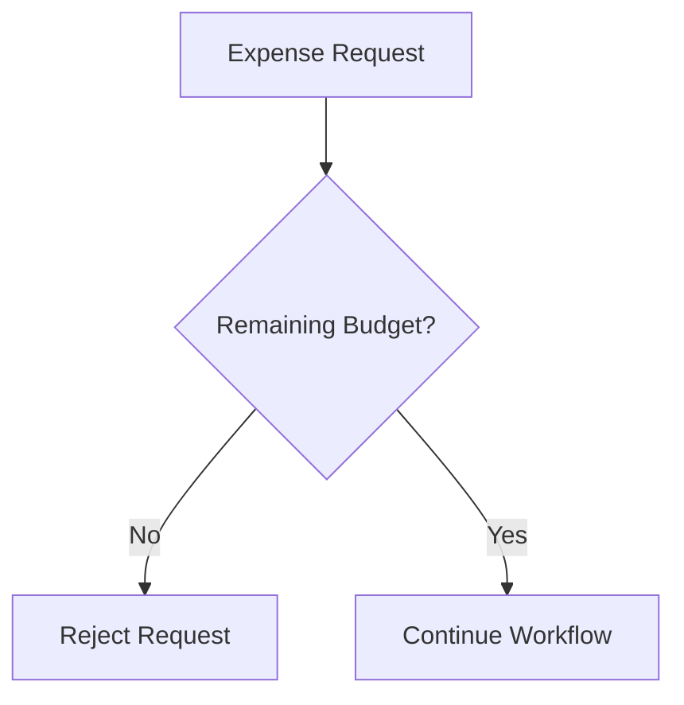

---

# 44. Audit Architecture

Auditability is a core system feature.

Not an afterthought.

---

## Audit Requirements

Every action must produce:

```text id="g3q3xu"
who
what
when
why
source
affected_entities
```

---

## Immutable Audit Trail

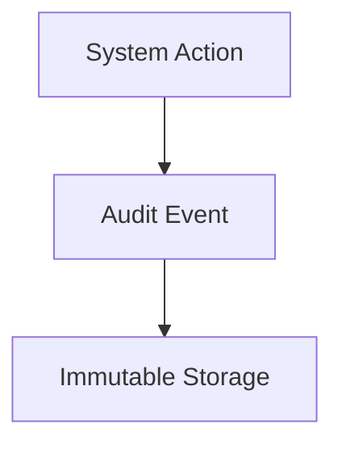

---

# 45. Identity & Permission Model

---

## Permission Architecture

RBAC + Policy-Based Access Control

---

## Example Roles

| Role             | Permissions       |
| ---------------- | ----------------- |
| Investor         | approve budgets   |
| Founder          | submit expenses   |
| Finance Operator | process workflows |
| Auditor          | read-only access  |
| Supplier         | upload invoices   |

---

## Forbidden Permissions

Example:

* founders cannot mutate ledger
* suppliers cannot approve payments

---

# 46. Notification System

Notifications are event-driven.

---

## Notification Events

```text id="xzbd26"
expense_approved
expense_rejected
payment_failed
budget_exceeded
escrow_released
suspicious_activity_detected
```

---

## Delivery Channels

```text id="h0on8x"
email
sms
webhook
in-app notifications
```

---

# 47. External Integrations

---

## Banking Integrations

Future-compatible architecture required.

---

## Integration Rules

* external systems never mutate ledger directly
* external events must be validated

---

# 48. Reconciliation Engine

Critical for financial consistency.

---

## Purpose

Detect inconsistencies between:

* treasury balances
* ledger balances
* external bank balances

---

## Reconciliation Flow

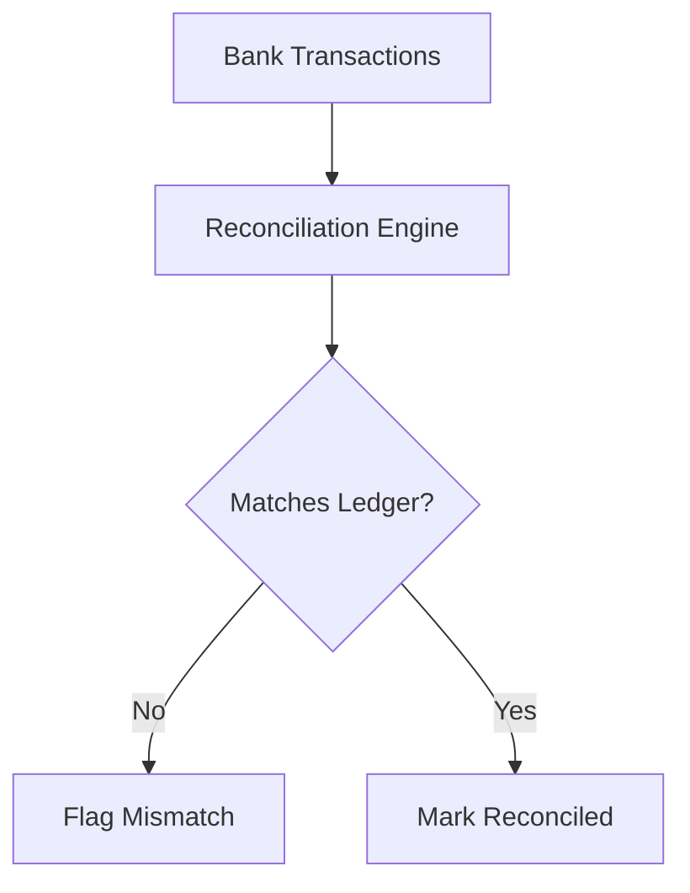

---

# 49. Failure Recovery Strategy

Financial systems must recover safely.

---

## Recovery Principles

* replay-safe events
* compensating transactions
* deterministic rebuilds

---

## Recovery Flow

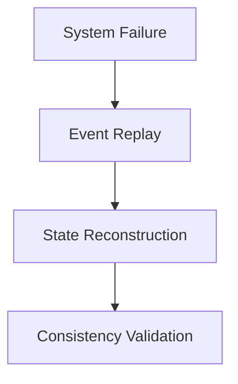

---

# 50. Event Replay Architecture

Required for deterministic recovery.

---

## Replay Rules

* events immutable
* replay order deterministic
* replay idempotent

---

# 51. Multi-Tenant Architecture

The platform must support multiple organizations safely.

---

## Isolation Requirements

* tenant-isolated data
* tenant-specific policies
* tenant-specific treasury scopes

---

## Forbidden

* cross-tenant ledger contamination

---

# 52. Currency Handling

Future-proof multi-currency architecture.

---

## Rules

* ledger currency explicit
* conversion events tracked
* no hidden FX conversions

---

# 53. Compliance Readiness

System should be compliance-friendly.

---

## Required Readiness

* audit exports
* immutable history
* transaction traceability

---

# 54. Data Retention Policy

---

## Financial Records

Retention:

```text id="3x5h1q"
permanent
```

---

## Operational Logs

Retention configurable.

---

# 55. Infrastructure Requirements

---

## Deployment Requirements

* containerized services
* horizontal scalability
* rolling deployments

---

## Reliability Targets

```text id="0n4yvk"
99.99% critical service uptime
```

---

# 56. Performance Requirements

---

## Targets

```text id="twv0e6"
ledger write latency < 100ms

workflow validation < 200ms

policy evaluation < 50ms
```

---

# 57. Security Hardening

---

## Mandatory Protections

* rate limiting
* API signing
* encrypted secrets
* audit-safe admin actions

---

## Sensitive Operations

Require:

* multi-step approval
* signed actions
* elevated authorization

---

# 58. Admin System Constraints

Admins are NOT superusers.

---

## Forbidden

* editing ledger entries
* bypassing policies
* hidden overrides

---

# 59. Developer Constraints

Claude Code must never generate:

* mutable financial history
* hidden side effects
* direct balance writes
* unsafe concurrent mutations

---

# 60. Critical Edge Cases

Claude Code must explicitly handle:

---

## Duplicate Requests

Example:

```text id="l90u9o"
same payment submitted twice
```

---

## Partial Failures

Example:

```text id="7m6lcl"
payment executed but ledger write failed
```

---

## Network Retry Attacks

Example:

```text id="1mjlwm"
duplicate API retries
```

---

# 61. Required Engineering Reviews Per Feature

Before merging any feature Claude Code must evaluate:

---

## Security Review

Questions:

* can this be abused?
* can approvals be bypassed?

---

## Financial Integrity Review

Questions:

* can balances desync?
* can ledger integrity break?

---

## Concurrency Review

Questions:

* what race conditions exist?

---

## Audit Review

Questions:

* can this action become invisible?

---

# 62. Final Technical Philosophy

trustC is NOT accounting software.

It is programmable capital governance infrastructure.

Every engineering decision must optimize for:

* financial integrity
* traceability
* deterministic behavior
* governance enforcement
* operational accountability

---

# 63. Final Claude Code Execution Prompt

You are the lead engineer for a programmable financial operating system called trustC.

This system manages controlled capital movement for investors and operational organizations.

You must think like:

* a distributed systems engineer
* a financial infrastructure architect
* a treasury systems designer
* an audit and compliance engineer
* a fraud prevention specialist

You must NEVER think like a CRUD app developer.

Critical requirements:

* immutable ledger
* append-only accounting
* policy-controlled transactions
* event-driven architecture
* replay-safe systems
* audit-safe infrastructure
* deterministic workflows

Never allow:

* direct balance mutation
* mutable ledger history
* bypassing workflows
* silent failures
* non-auditable actions

For every implementation:

* identify attack vectors
* identify race conditions
* identify invariant violations
* identify fraud risks
* identify audit gaps

Always prefer:

* integrity over convenience
* traceability over simplicity
* deterministic behavior over implicit magic

You are building financial governance infrastructure, not a startup MVP.

# 64. Domain-Driven Design (DDD) Strategy

The system MUST follow strict domain boundaries.

No shared mutable business logic across domains.

---

## Core Domains

```text id="b1fx4e"
ledger-domain
treasury-domain
workflow-domain
governance-domain
audit-domain
identity-domain
notification-domain
```

---

## Domain Ownership

| Domain     | Owns                           |
| ---------- | ------------------------------ |
| Ledger     | accounting truth               |
| Treasury   | capital movement               |
| Workflow   | approval orchestration         |
| Governance | policy enforcement             |
| Audit      | immutable history              |
| Identity   | authentication & authorization |

---

## Forbidden Architecture Pattern

```text id="u71hqt"
shared god-service
```

---

# 65. Bounded Context Definitions

---

## Treasury Context

Responsible ONLY for:

* fund allocation
* locks
* releases
* capital routing

NOT responsible for:

* accounting logic
* approval workflows

---

## Ledger Context

Responsible ONLY for:

* financial truth
* accounting entries
* balance projections

NOT responsible for:

* business approvals

---

## Governance Context

Responsible ONLY for:

* validation
* policy enforcement
* anomaly analysis

---

# 66. CQRS Strategy

Recommended for scalability.

---

## Command Side

Responsible for:

* writes
* workflow transitions
* financial actions

---

## Query Side

Responsible for:

* dashboards
* analytics
* reporting

---

## CQRS Flow

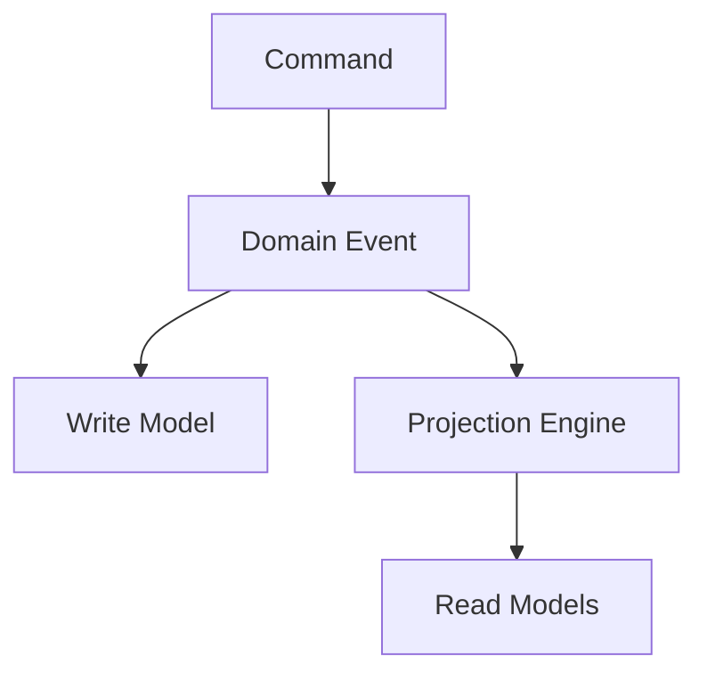

---

# 67. Event Sourcing Recommendation

Highly recommended for ledger and workflow systems.

---

## Benefits

* replayability
* auditability
* deterministic recovery

---

## Constraints

* immutable events only
* versioned schemas required

---

# 68. Projection Architecture

Read models should be eventually consistent.

---

## Example Projections

```text id="7vqyr8"
investor_dashboard_projection

burn_rate_projection

cashflow_projection

budget_usage_projection
```

---

# 69. Financial Consistency Model

The system must guarantee accounting consistency.

---

## Golden Rule

Every treasury action MUST generate ledger consequences.

---

## Forbidden State

```text id="f90bdk"
money moved without accounting entry
```

---

# 70. Consistency Strategy

---

## Strong Consistency Required

For:

* ledger writes
* treasury state transitions

---

## Eventual Consistency Allowed

For:

* dashboards
* analytics
* notifications

---

# 71. Ledger Account Model

---

## Account Types

```text id="s2m0im"
asset
liability
equity
expense
revenue
escrow
```

---

## Example Accounts

```text id="x5vlnq"
cash_account

marketing_expense

payroll_expense

escrow_liability

supplier_payable
```

---

# 72. Double-Entry Accounting Rules

Every transaction must balance.

---

## Example


---

## Validation Formula

\sum debits = \sum credits

---

# 73. Treasury Locking Mechanism

Funds can exist in multiple states.

---

## Fund States

```text id="urhxz6"
available
allocated
locked
released
consumed
refunded
```

---

## Transition Rules

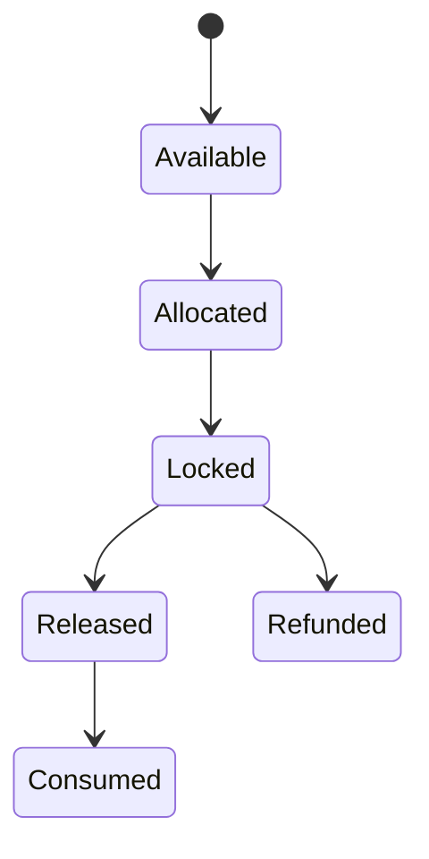

---

# 74. Budget Allocation Engine

Budgets are policy-constrained resource containers.

---

## Budget Logic

```text id="5nqbd0"
budget allocation != wallet ownership
```

---

## Allocation Example

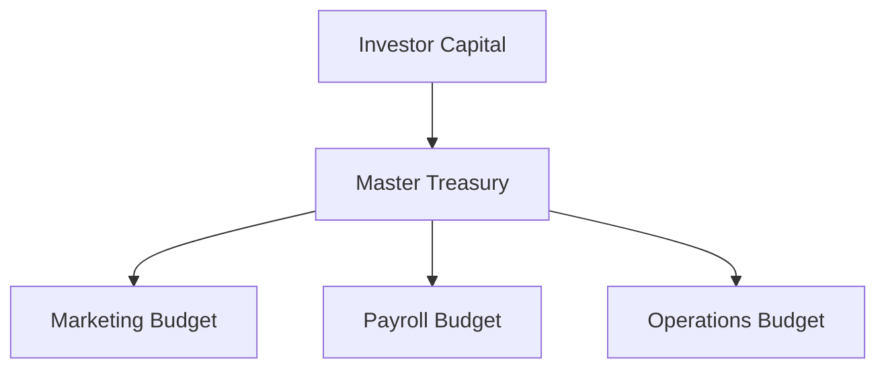

---

# 75. Smart Policy Evaluation Engine

Policies must be composable.

---

## Policy Evaluation Flow

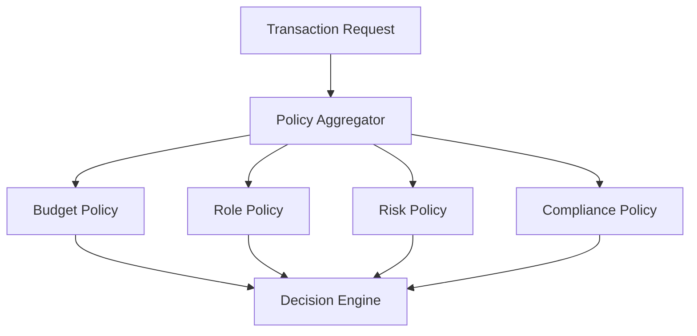

---

## Policy Output

```json id="uwf1fh"
{
  "decision": "allow",
  "reasons": [],
  "risk_score": 0.12
}
```

---

# 76. Risk Scoring System

Every transaction may receive risk evaluation.

---

## Inputs

```text id="q7kkjq"
transaction_amount
vendor_history
approval_pattern
budget_variance
frequency
geo-location
```

---

## Output

```text id="rbxgoq"
risk_score: 0.0 -> 1.0
```

---

# 77. Fraud Detection Architecture

Future AI-assisted layer.

---

## Fraud Signals

```text id="8x4v53"
duplicate invoices

unusual spending spikes

approval anomalies

vendor collusion patterns
```

---

## Fraud Response Flow

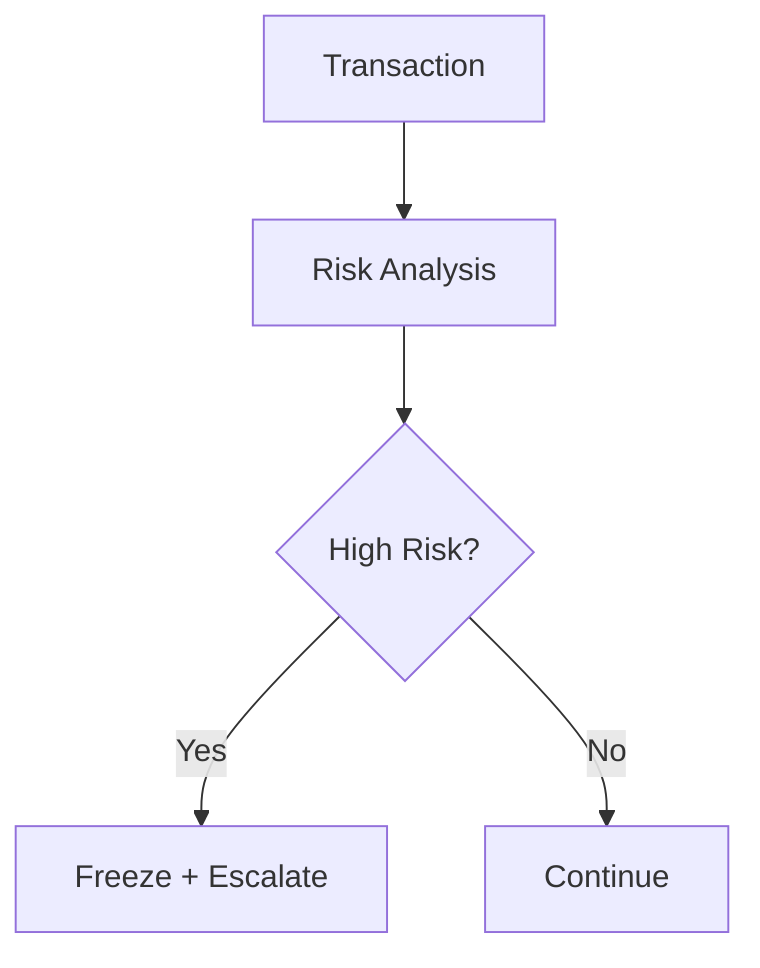

---

# 78. Supplier Verification System

Suppliers must be validated entities.

---

## Supplier States

```text id="3v8b2v"
pending
verified
restricted
blocked
```

---

## Verification Flow

```mermaid id="42g6hq"
flowchart TD

A[Supplier Registration]
--> B[Compliance Check]

B --> C{Approved?}

C -->|Yes| D[Verified Supplier]

C -->|No| E[Blocked]
```

---

# 79. Operational Context Model

Financial actions require operational references.

---

## Required Context Fields

```text id="1v0wbo"
project_id
workflow_id
business_reason
actor_id
cost_center
related_documents
```

---

# 80. Cost Center Architecture

All spending should map to operational units.

---

## Example Cost Centers

```text id="zyb8hq"
marketing
engineering
operations
support
sales
```

---

## Spend Traceability

```mermaid id="9ln74w"
flowchart TD

A[Expense]
--> B[Cost Center]

B --> C[Budget Tracking]

C --> D[Investor Visibility]
```

---

# 81. Time-Based Budget Controls

Budgets may have temporal restrictions.

---

## Example

```yaml id="1z1h5m"
monthly_marketing_budget:
  limit: 50000
  reset_cycle: monthly
```

---

# 82. Approval Threshold Rules

Large transactions require stronger governance.

---

## Example

```yaml id="0k4wzv"
if amount > 100000:
  require:
    - finance_director
    - investor_approval
```

---

# 83. Multi-Signature Approval Model

Critical actions may require multiple approvals.

---

## Flow

```mermaid id="p1y5r9"
flowchart TD

A[High Value Transaction]
--> B[Finance Approval]

B --> C[Investor Approval]

C --> D[Execution]
```

---

# 84. Emergency Freeze System

Critical protection mechanism.

---

## Trigger Conditions

```text id="fjlwm1"
fraud suspicion

policy breach

abnormal transaction spike

treasury inconsistency
```

---

## Freeze Flow

```mermaid id="njlwm7"
flowchart TD

A[Critical Risk Detected]
--> B[Freeze Treasury Actions]

B --> C[Alert Security Team]
```

---

# 85. Disaster Recovery Architecture

Financial continuity is mandatory.

---

## Requirements

* multi-region backups
* event replay recovery
* point-in-time restore
* immutable backup snapshots

---

# 86. Backup Policy

---

## Ledger Backups

```text id="jlwmx0"
continuous replication
```

---

## Audit Logs

```text id="pnwv3x"
write-once archival storage
```

---

# 87. Governance Analytics Layer

Investor visibility system.

---

## Analytics Examples

```text id="87m67v"
burn_rate

cash_runway

department_spend

budget_variance

supplier_dependency
```

---

## Governance Dashboard Flow

```mermaid id="jw8y9x"
flowchart TD

A[Operational Events]
--> B[Financial Events]

B --> C[Analytics Engine]

C --> D[Investor Dashboard]
```

---

# 88. Cash Runway Prediction

Predictive treasury analytics.

---

## Formula

Runway = \frac{Available\ Cash}{Monthly\ Burn\ Rate}

---

# 89. Burn Rate Monitoring

Real-time operational spending visibility.

---

## Formula

Burn\ Rate = Monthly\ Expenses - Monthly\ Revenue

---

# 90. Strategic System Objective

trustC aims to transform financial governance from:

```text id="6md8j7"
human trust
```

into:

```text id="o4qjlwm"
programmable enforcement
```

The system should ultimately enable:

* autonomous governance
* machine-verifiable accounting
* policy-controlled capital flows
* real-time investor visibility
* operationally-aware treasury systems

# 64. Domain-Driven Design (DDD) Strategy

The system MUST follow strict domain boundaries.

No shared mutable business logic across domains.

---

## Core Domains

```text id="b1fx4e"
ledger-domain
treasury-domain
workflow-domain
governance-domain
audit-domain
identity-domain
notification-domain
```

---

## Domain Ownership

| Domain     | Owns                           |
| ---------- | ------------------------------ |
| Ledger     | accounting truth               |
| Treasury   | capital movement               |
| Workflow   | approval orchestration         |
| Governance | policy enforcement             |
| Audit      | immutable history              |
| Identity   | authentication & authorization |

---

## Forbidden Architecture Pattern

```text id="u71hqt"
shared god-service
```

---

# 65. Bounded Context Definitions

---

## Treasury Context

Responsible ONLY for:

* fund allocation
* locks
* releases
* capital routing

NOT responsible for:

* accounting logic
* approval workflows

---

## Ledger Context

Responsible ONLY for:

* financial truth
* accounting entries
* balance projections

NOT responsible for:

* business approvals

---

## Governance Context

Responsible ONLY for:

* validation
* policy enforcement
* anomaly analysis

---

# 66. CQRS Strategy

Recommended for scalability.

---

## Command Side

Responsible for:

* writes
* workflow transitions
* financial actions

---

## Query Side

Responsible for:

* dashboards
* analytics
* reporting

---

## CQRS Flow

```mermaid id="9g9y8j"
flowchart TD

A[Command]
--> B[Domain Event]

B --> C[Write Model]

B --> D[Projection Engine]

D --> E[Read Models]
```

---

# 67. Event Sourcing Recommendation

Highly recommended for ledger and workflow systems.

---

## Benefits

* replayability
* auditability
* deterministic recovery

---

## Constraints

* immutable events only
* versioned schemas required

---

# 68. Projection Architecture

Read models should be eventually consistent.

---

## Example Projections

```text id="7vqyr8"
investor_dashboard_projection

burn_rate_projection

cashflow_projection

budget_usage_projection
```

---

# 69. Financial Consistency Model

The system must guarantee accounting consistency.

---

## Golden Rule

Every treasury action MUST generate ledger consequences.

---

## Forbidden State

```text id="f90bdk"
money moved without accounting entry
```

---

# 70. Consistency Strategy

---

## Strong Consistency Required

For:

* ledger writes
* treasury state transitions

---

## Eventual Consistency Allowed

For:

* dashboards
* analytics
* notifications

---

# 71. Ledger Account Model

---

## Account Types

```text id="s2m0im"
asset
liability
equity
expense
revenue
escrow
```

---

## Example Accounts

```text id="x5vlnq"
cash_account

marketing_expense

payroll_expense

escrow_liability

supplier_payable
```

---

# 72. Double-Entry Accounting Rules

Every transaction must balance.

---

## Example

```mermaid id="s2mjlwm"
flowchart LR

A[Cash Account Credit]
--> B[Expense Account Debit]
```

---

## Validation Formula

\sum debits = \sum credits

---

# 73. Treasury Locking Mechanism

Funds can exist in multiple states.

---

## Fund States

```text id="urhxz6"
available
allocated
locked
released
consumed
refunded
```

---

## Transition Rules

```mermaid id="6z5b1h"
stateDiagram-v2

[*] --> Available

Available --> Allocated

Allocated --> Locked

Locked --> Released

Locked --> Refunded

Released --> Consumed
```

---

# 74. Budget Allocation Engine

Budgets are policy-constrained resource containers.

---

## Budget Logic

```text id="5nqbd0"
budget allocation != wallet ownership
```

---

## Allocation Example

```mermaid id="k0s1m8"
flowchart TD

A[Investor Capital]
--> B[Master Treasury]

B --> C[Marketing Budget]

B --> D[Payroll Budget]

B --> E[Operations Budget]
```

---

# 75. Smart Policy Evaluation Engine

Policies must be composable.

---

## Policy Evaluation Flow

```mermaid id="4wq3m4"
flowchart TD

A[Transaction Request]
--> B[Policy Aggregator]

B --> C[Budget Policy]

B --> D[Role Policy]

B --> E[Risk Policy]

B --> F[Compliance Policy]

C --> G[Decision Engine]
D --> G
E --> G
F --> G
```

---

## Policy Output

```json id="uwf1fh"
{
  "decision": "allow",
  "reasons": [],
  "risk_score": 0.12
}
```

---

# 76. Risk Scoring System

Every transaction may receive risk evaluation.

---

## Inputs

```text id="q7kkjq"
transaction_amount
vendor_history
approval_pattern
budget_variance
frequency
geo-location
```

---

## Output

```text id="rbxgoq"
risk_score: 0.0 -> 1.0
```

---

# 77. Fraud Detection Architecture

Future AI-assisted layer.

---

## Fraud Signals

```text id="8x4v53"
duplicate invoices

unusual spending spikes

approval anomalies

vendor collusion patterns
```

---

## Fraud Response Flow

```mermaid id="mjlwmw"
flowchart TD

A[Transaction]
--> B[Risk Analysis]

B --> C{High Risk?}

C -->|Yes| D[Freeze + Escalate]

C -->|No| E[Continue]
```

---

# 78. Supplier Verification System

Suppliers must be validated entities.

---

## Supplier States

```text id="3v8b2v"
pending
verified
restricted
blocked
```

---

## Verification Flow

```mermaid id="42g6hq"
flowchart TD

A[Supplier Registration]
--> B[Compliance Check]

B --> C{Approved?}

C -->|Yes| D[Verified Supplier]

C -->|No| E[Blocked]
```

---

# 79. Operational Context Model

Financial actions require operational references.

---

## Required Context Fields

```text id="1v0wbo"
project_id
workflow_id
business_reason
actor_id
cost_center
related_documents
```

---

# 80. Cost Center Architecture

All spending should map to operational units.

---

## Example Cost Centers

```text id="zyb8hq"
marketing
engineering
operations
support
sales
```

---

## Spend Traceability

```mermaid id="9ln74w"
flowchart TD

A[Expense]
--> B[Cost Center]

B --> C[Budget Tracking]

C --> D[Investor Visibility]
```

---

# 81. Time-Based Budget Controls

Budgets may have temporal restrictions.

---

## Example

```yaml id="1z1h5m"
monthly_marketing_budget:
  limit: 50000
  reset_cycle: monthly
```

---

# 82. Approval Threshold Rules

Large transactions require stronger governance.

---

## Example

```yaml id="0k4wzv"
if amount > 100000:
  require:
    - finance_director
    - investor_approval
```

---

# 83. Multi-Signature Approval Model

Critical actions may require multiple approvals.

---

## Flow

```mermaid id="p1y5r9"
flowchart TD

A[High Value Transaction]
--> B[Finance Approval]

B --> C[Investor Approval]

C --> D[Execution]
```

---

# 84. Emergency Freeze System

Critical protection mechanism.

---

## Trigger Conditions

```text id="fjlwm1"
fraud suspicion

policy breach

abnormal transaction spike

treasury inconsistency
```

---

## Freeze Flow

```mermaid id="njlwm7"
flowchart TD

A[Critical Risk Detected]
--> B[Freeze Treasury Actions]

B --> C[Alert Security Team]
```

---

# 85. Disaster Recovery Architecture

Financial continuity is mandatory.

---

## Requirements

* multi-region backups
* event replay recovery
* point-in-time restore
* immutable backup snapshots

---

# 86. Backup Policy

---

## Ledger Backups

```text id="jlwmx0"
continuous replication
```

---

## Audit Logs

```text id="pnwv3x"
write-once archival storage
```

---

# 87. Governance Analytics Layer

Investor visibility system.

---

## Analytics Examples

```text id="87m67v"
burn_rate

cash_runway

department_spend

budget_variance

supplier_dependency
```

---

## Governance Dashboard Flow

```mermaid id="jw8y9x"
flowchart TD

A[Operational Events]
--> B[Financial Events]

B --> C[Analytics Engine]

C --> D[Investor Dashboard]
```

---

# 88. Cash Runway Prediction

Predictive treasury analytics.

---

## Formula

Runway = \frac{Available\ Cash}{Monthly\ Burn\ Rate}

---

# 89. Burn Rate Monitoring

Real-time operational spending visibility.

---

## Formula

Burn\ Rate = Monthly\ Expenses - Monthly\ Revenue

---

# 90. Strategic System Objective

trustC aims to transform financial governance from:

```text id="6md8j7"
human trust
```

into:

```text id="o4qjlwm"
programmable enforcement
```

The system should ultimately enable:

* autonomous governance
* machine-verifiable accounting
* policy-controlled capital flows
* real-time investor visibility
* operationally-aware treasury systems

# 121. Operational Workflow Architecture

Operational actions and financial actions must remain tightly coupled.

No financial event should exist without operational origin.

---

## Operational-to-Financial Mapping

```mermaid id="2z7q1m"
flowchart TD

A[Operational Action]
--> B[Workflow Validation]

B --> C[Governance Check]

C --> D[Financial Authorization]

D --> E[Treasury Action]

E --> F[Ledger Entry]
```

---

## Rule

```text id="8k2v1m"
every financial action must map to an operational workflow
```

---

# 122. Workflow Integrity Constraints

Workflow corruption must be impossible.

---

## Constraints

* no skipped approvals
* no hidden state transitions
* no unauthorized transitions
* all transitions timestamped

---

## Transition Validation

```mermaid id="1m7q8v"
flowchart TD

A[Transition Request]
--> B[Permission Check]

B --> C[State Validation]

C --> D[Policy Validation]

D --> E[Transition Accepted]
```

---

# 123. Approval Chain Architecture

Approvals are structured governance events.

Not simple UI actions.

---

## Approval Metadata

```text id="6x3m9q"
approver_id
timestamp
approval_reason
risk_score
approval_signature
```

---

## Approval Integrity

```text id="5w1q9n"
approvals are immutable after submission
```

---

# 124. Treasury Exposure Segmentation

Capital pools should be isolated by risk profile.

---

## Treasury Segments

```text id="9m2q7v"
operational_treasury

payroll_treasury

escrow_treasury

reserve_treasury

emergency_treasury
```

---

## Segmentation Flow

```mermaid id="0x9m3q"
flowchart TD

A[Master Treasury]
--> B[Operational Pool]

A --> C[Payroll Pool]

A --> D[Escrow Pool]

A --> E[Reserve Pool]
```

---

# 125. Escrow Release Verification

Escrow release requires proof conditions.

---

## Verification Inputs

```text id="3q7m1v"
delivery_confirmation

document_verification

approval_signature

supplier_validation
```

---

## Escrow Verification Flow

```mermaid id="8q1m4z"
flowchart TD

A[Escrow Release Request]
--> B[Verification Engine]

B --> C{Conditions Satisfied?}

C -->|No| D[Reject Release]

C -->|Yes| E[Release Funds]
```

---

# 126. Supplier Risk Profiling

Suppliers should accumulate trust history.

---

## Risk Inputs

```text id="2w8m1q"
delivery_failures

dispute_history

payment_patterns

invoice_anomalies
```

---

## Supplier Risk Levels

```text id="7n4m2x"
low
medium
high
blocked
```

---

# 127. Behavioral Monitoring Layer

Monitor organizational financial behavior patterns.

---

## Monitoring Signals

```text id="1v9m7q"
spending spikes

unusual approval timing

budget deviation

rapid vendor creation
```

---

# 128. Governance Escalation System

High-risk activity requires escalation.

---

## Escalation Flow

```mermaid id="9x2m7q"
flowchart TD

A[Risk Detected]
--> B[Escalation Engine]

B --> C[Investor Alert]

B --> D[Freeze Actions]

B --> E[Compliance Review]
```

---

# 129. Financial Health Scoring

Organizations should receive operational risk scores.

---

## Inputs

```text id="6q1m8v"
burn_rate

runway

budget_variance

payment_failures

supplier_risk
```

---

## Example Formula

Health\ Score = f(Burn\ Rate, Runway, Budget\ Variance, Risk\ Signals)

---

# 130. Capital Efficiency Analytics

Measure effectiveness of capital deployment.

---

## Metrics

```text id="0m3q8v"
cost_per_growth

department_efficiency

ROI_by_budget

capital_utilization
```

---

# 131. Budget Drift Analysis

Detect divergence between planned and actual spending.

---

## Drift Formula

Budget\ Drift = Actual\ Spend - Planned\ Budget

---

# 132. Investor Control Modes

Different governance models should exist.

---

## Modes

| Mode              | Description                  |
| ----------------- | ---------------------------- |
| passive           | monitoring only              |
| approval_required | approvals required           |
| strict_governance | policy enforcement mandatory |
| autonomous        | AI-assisted governance       |

---

# 133. Autonomous Governance Vision

Future architecture direction.

---

## Objective

Reduce dependency on manual oversight.

---

## Future AI Capabilities

```text id="9w2m1v"
automatic anomaly detection

predictive treasury warnings

autonomous budget restrictions

risk-adaptive approvals
```

---

# 134. Treasury Simulation Engine

Future planning capability.

---

## Use Cases

```text id="5x1m7q"
runway forecasting

budget impact simulation

stress testing
```

---

## Simulation Formula Example

Projected\ Runway = \frac{Cash - Forecasted\ Expenses}{Projected\ Burn\ Rate}

---

# 135. Stress Testing Framework

Simulate financial crises.

---

## Scenarios

```text id="3m8q1v"
revenue collapse

supplier default

fraud spike

unexpected burn increase
```

---

## Stress Flow

```mermaid id="7m2q8v"
flowchart TD

A[Scenario Injection]
--> B[Simulation Engine]

B --> C[Impact Analysis]

C --> D[Governance Recommendations]
```

---

# 136. Operational Accountability Model

Every expense must have ownership.

---

## Ownership Metadata

```text id="1n8m4q"
request_owner

approver

executing_actor

cost_center_owner
```

---

# 137. Audit Investigation Framework

Investigators need trace reconstruction.

---

## Investigation Capabilities

```text id="2x7m1q"
transaction lineage

approval history

event chain replay

actor tracing
```

---

## Investigation Flow

```mermaid id="4m1q9v"
flowchart TD

A[Incident Detected]
--> B[Audit Reconstruction]

B --> C[Event Trace Analysis]

C --> D[Root Cause Detection]
```

---

# 138. Fraud Containment Strategy

Fraud containment must be immediate.

---

## Response Actions

```text id="8m2q1v"
freeze wallets

block approvals

suspend suppliers

escalate alerts
```

---

# 139. Human Error Mitigation

Design must reduce operational mistakes.

---

## Strategies

* confirmation steps
* policy pre-validation
* transaction previews
* approval summaries

---

# 140. Explainable Financial Systems

Every financial action should be explainable.

---

## Example Explanation

```json id="6m1q8v"
{
  "transaction_id": "txn_001",
  "status": "approved",
  "approved_by": ["finance_director"],
  "policy_checks": [
    "budget_valid",
    "supplier_verified",
    "risk_score_acceptable"
  ]
}
```

---

# 141. Operational Transparency Doctrine

Visibility reduces governance risk.

---

## Visibility Targets

```text id="5m9q2v"
real_time_cash_position

live_budget_usage

approval_latency

risk_exposure
```

---

# 142. Trust Minimization Philosophy

The system must minimize dependence on human trust.

---

## Replace Trust With

```text id="3q1m8v"
verification

policy enforcement

auditability

traceability
```

---

# 143. Final Strategic Positioning

trustC represents a shift from:

```text id="8x1m4q"
reactive accounting systems
```

toward:

```text id="0q9m2v"
programmable financial governance infrastructure
```

---

# 144. End-State Vision

The long-term objective is a system where:

* capital movement is policy-governed
* accounting is autonomous
* treasury behavior is verifiable
* fraud detection is proactive
* investor oversight is real-time
* operational accountability is enforceable
* governance becomes infrastructure-native

---

# 145. Ultimate Engineering Principle

If a financial action cannot be:

* traced
* verified
* audited
* replayed
* explained

then the system must not allow it.

# 146. Runtime Governance Architecture

Governance must operate continuously at runtime.

Not only during approvals.

---

## Runtime Governance Responsibilities

```text id="rt1m8q"
continuous policy evaluation

risk monitoring

behavior anomaly detection

treasury exposure analysis

real-time restriction enforcement
```

---

## Runtime Governance Flow

```mermaid id="gv7m2q"
flowchart TD

A[Live Financial Events]
--> B[Runtime Governance Engine]

B --> C[Policy Evaluation]

B --> D[Risk Scoring]

B --> E[Behavior Analysis]

C --> F[Decision Layer]

D --> F

E --> F

F --> G[Allow / Restrict / Freeze]
```

---

# 147. Dynamic Policy Engine

Policies should support runtime adaptation.

---

## Policy Types

| Policy Type | Example                 |
| ----------- | ----------------------- |
| static      | fixed budget limits     |
| contextual  | vendor-specific rules   |
| temporal    | time-based restrictions |
| adaptive    | risk-adjusted approvals |

---

## Example Dynamic Policy

```yaml id="dy4m8q"
rule: elevated_approval_after_midnight

conditions:
  - transaction_time > "22:00"

action:
  require_additional_approval
```

---

# 148. Temporal Governance Controls

Time-sensitive financial restrictions.

---

## Examples

```text id="tm2q8v"
weekend payment restrictions

night-time transaction review

monthly budget resets

quarter-end approval escalation
```

---

# 149. Governance Decision Graph

Governance should produce deterministic decisions.

---

## Decision Flow

```mermaid id="dg8m1q"
flowchart TD

A[Transaction Request]
--> B[Identity Validation]

B --> C[Budget Validation]

C --> D[Policy Evaluation]

D --> E[Risk Assessment]

E --> F{Decision}

F -->|Allow| G[Continue]

F -->|Reject| H[Block]

F -->|Escalate| I[Manual Review]
```

---

# 150. Risk-Adaptive Governance

Higher risk requires stronger controls.

---

## Example

```yaml id="rk1m7q"
if risk_score > 0.8:
  require:
    - investor_approval
    - compliance_review
```

---

# 151. Continuous Treasury Monitoring

Treasury health must be continuously evaluated.

---

## Treasury Signals

```text id="tr9m2v"
liquidity pressure

excessive withdrawals

unusual allocation patterns

escrow imbalance
```

---

# 152. Liquidity Protection Layer

Prevent treasury exhaustion.

---

## Liquidity Formula

Liquidity\ Ratio = \frac{Available\ Liquid\ Assets}{Short\ Term\ Obligations}

---

## Liquidity Response

```mermaid id="lq7m1v"
flowchart TD

A[Liquidity Drop Detected]
--> B[Restriction Engine]

B --> C[Limit Nonessential Spending]

C --> D[Alert Investors]
```

---

# 153. Treasury Reserve System

Emergency reserves should be isolated.

---

## Reserve Rules

```text id="rv1m8q"
cannot fund operational expenses

requires elevated approval

restricted access only
```

---

# 154. Budget Locking System

Budgets can enter protected states.

---

## Budget States

```text id="bg2m7q"
active

restricted

frozen

expired
```

---

## Budget Lock Flow

```mermaid id="bk8m1q"
stateDiagram-v2

[*] --> Active

Active --> Restricted

Restricted --> Frozen

Frozen --> Active

Active --> Expired
```

---

# 155. Approval Latency Monitoring

Slow approvals create operational risk.

---

## Metrics

```text id="ap7m2v"
average_approval_time

approval_bottlenecks

pending_high_risk_requests
```

---

# 156. Governance SLA System

Critical financial actions require time guarantees.

---

## Example

```yaml id="sl1m9q"
high_priority_payments:
  approval_sla: 15_minutes
```

---

# 157. Emergency Governance Overrides

Extreme situations may require controlled override mechanisms.

---

## Constraints

Overrides must:

* be fully audited
* require multi-signature approval
* trigger investigation events

---

## Override Flow

```mermaid id="ov7m2q"
flowchart TD

A[Emergency Override Request]
--> B[Multi-Signature Approval]

B --> C[Audit Event Generation]

C --> D[Temporary Override Execution]
```

---

# 158. Governance Explainability Layer

Every governance action must be explainable to humans.

---

## Example Output

```json id="gx2m8q"
{
  "decision": "escalated",
  "risk_score": 0.87,
  "reasons": [
    "vendor risk elevated",
    "budget variance exceeded threshold"
  ]
}
```

---

# 159. Capital Allocation Intelligence

Capital should be measurable by efficiency.

---

## Allocation Metrics

```text id="ca1m7q"
return_on_allocated_capital

budget_efficiency

capital_idle_ratio
```

---

# 160. Idle Capital Detection

Unused capital should be visible.

---

## Formula

Idle\ Capital = Allocated\ Capital - Utilized\ Capital

---

# 161. Organizational Financial Graph

The system should model relationships between actors and capital flows.

---

## Nodes

```text id="fg9m2v"
employees

suppliers

wallets

budgets

approvers

projects
```

---

## Edges

```text id="ed2m8q"
payment_flows

approval_relationships

budget_dependencies
```

---

# 162. Relationship Risk Detection

Detect suspicious financial relationships.

---

## Examples

```text id="rr1m7q"
same approver + same vendor pattern

circular payments

approval concentration risk
```

---

# 163. Governance Intelligence Layer

Future layer for governance optimization.

---

## Objectives

```text id="gi8m2v"
predict governance failures

recommend policy improvements

identify inefficient controls
```

---

# 164. Operational Risk Heatmap

Visualize organizational financial risk.

---

## Risk Zones

```text id="rh1m9q"
high-risk departments

high-risk vendors

high-risk workflows
```

---

# 165. Governance Simulation Framework

Simulate governance policy outcomes.

---

## Example Questions

```text id="gs7m2v"
what happens if approvals tighten?

what happens if burn increases 40%?

what happens if supplier failure occurs?
```

---

# 166. Treasury Stress Index

Composite treasury risk indicator.

---

## Formula

Treasury\ Stress\ Index = f(Liquidity, Burn\ Rate, Exposure, Risk\ Events)

---

# 167. Operational-to-Capital Accountability

Operational teams should be accountable for capital efficiency.

---

## Accountability Metrics

```text id="oa1m8q"
budget adherence

waste ratio

approval efficiency

cost center performance
```

---

# 168. Financial Governance Maturity Model

Organizations may evolve governance sophistication.

---

## Levels

| Level   | Description           |
| ------- | --------------------- |
| level_1 | manual governance     |
| level_2 | workflow governance   |
| level_3 | policy enforcement    |
| level_4 | real-time governance  |
| level_5 | autonomous governance |

---

# 169. Long-Term Vision

trustC should evolve into:

* autonomous treasury infrastructure
* programmable governance fabric
* machine-verifiable financial system
* real-time capital intelligence platform

---

# 170. Final Foundational Doctrine

The system must guarantee that:

* capital cannot move invisibly
* approvals cannot disappear
* accounting cannot diverge from reality
* treasury actions cannot escape governance
* operational accountability cannot be bypassed

If these guarantees fail, the system has failed fundamentally.


# 171. Capital Flow Graph Architecture

All capital movement should be representable as a graph.

This enables:

* traceability
* fraud analysis
* dependency mapping
* exposure analysis

---

## Capital Flow Graph

```mermaid id="cf8m1q"
flowchart LR

A[Investor Treasury]
--> B[Marketing Budget]

B --> C[Vendor Payment]

C --> D[Supplier Wallet]

D --> E[Settlement Event]
```

---

## Graph Objectives

```text id="cg2m7v"
trace money origin

trace destination chains

detect suspicious loops

measure capital concentration
```

---

# 172. Transaction Lineage System

Every transaction must support lineage reconstruction.

---

## Required Capabilities

```text id="tl1m9q"
parent transaction tracking

workflow ancestry

approval ancestry

ledger ancestry
```

---

## Lineage Example

```mermaid id="ln7m2q"
flowchart TD

A[Investor Capital Injection]
--> B[Budget Allocation]

B --> C[Expense Approval]

C --> D[Vendor Payment]

D --> E[Ledger Settlement]
```

---

# 173. Provenance Architecture

Financial provenance is mandatory.

---

## Every transaction must answer:

```text id="pv8m2v"
where did this money originate?

who approved it?

why was it spent?

what operational activity justified it?
```

---

# 174. Governance Dependency Mapping

Policies may depend on other governance states.

---

## Example Dependencies

```text id="gd1m7q"
vendor status

budget health

risk level

compliance state
```

---

## Dependency Flow

```mermaid id="dp7m1q"
flowchart TD

A[Transaction]
--> B[Policy Dependencies]

B --> C[Risk State]

B --> D[Vendor State]

B --> E[Budget State]

C --> F[Decision]
D --> F
E --> F
```

---

# 175. Recursive Approval Risk

Approval chains themselves can become risk vectors.

---

## Risks

```text id="ra8m2v"
approval collusion

single approver dominance

rubber-stamp approvals
```

---

## Detection Signals

```text id="rd1m8q"
same approver patterns

abnormally fast approvals

repeated approval clusters
```

---

# 176. Governance Integrity Verification

System integrity should be continuously verified.

---

## Verification Targets

```text id="gv7m9q"
ledger consistency

treasury consistency

workflow integrity

policy enforcement coverage
```

---

## Verification Flow

```mermaid id="vf2m7q"
flowchart TD

A[Integrity Scanner]
--> B[Consistency Validation]

B --> C[Anomaly Detection]

C --> D[Governance Report]
```

---

# 177. Financial Entropy Monitoring

Uncontrolled systems drift toward disorder.

---

## Entropy Signals

```text id="fe1m8q"
untracked expenses

policy exceptions

manual overrides

orphan transactions
```

---

# 178. Governance Drift Detection

Detect weakening governance discipline.

---

## Drift Examples

```text id="gd8m2v"
increasing override frequency

rising policy violations

growing approval latency

escalating risk tolerance
```

---

# 179. Organizational Trust Index

Measure operational governance reliability.

---

## Inputs

```text id="ti1m7q"
policy compliance

audit consistency

financial anomalies

approval discipline
```

---

## Example Formula

Trust\ Index = f(Compliance, Audit\ Integrity, Risk\ Events, Governance\ Stability)

---

# 180. Financial Reality Synchronization

Accounting must remain synchronized with operational reality.

---

## Forbidden State

```text id="fr8m2v"
reported profits disconnected from treasury reality
```

---

## Synchronization Principle

```mermaid id="sr1m9q"
flowchart TD

A[Operational Events]
--> B[Financial Events]

B --> C[Ledger Truth]

C --> D[Investor Visibility]
```

---

# 181. Treasury Truth Model

Treasury state must derive from ledger truth.

Never the opposite.

---

## Formula

Treasury\ State = f(Ledger\ Events)

---

# 182. Policy Coverage Analysis

Measure how much of the organization is governed.

---

## Coverage Areas

```text id="pc7m2q"
payments

budgets

suppliers

approvals

expense categories
```

---

## Coverage Goal

```text id="pg1m8q"
100% governed capital movement
```

---

# 183. Exception Management Framework

Exceptions are dangerous and must be controlled.

---

## Exception Rules

* temporary only
* fully audited
* explicitly approved
* automatically reviewed

---

## Exception Flow

```mermaid id="ex8m2v"
flowchart TD

A[Exception Request]
--> B[Risk Review]

B --> C[Executive Approval]

C --> D[Temporary Exception Grant]
```

---

# 184. Financial Policy Compiler

Future architecture direction.

---

## Vision

Policies become executable governance logic.

---

## Example

```yaml id="fp1m7q"
policy:
  name: vendor_payment_limit

logic:
  if:
    amount > 50000
  then:
    require:
      - investor_approval
```

---

# 185. Governance-as-Code Philosophy

Governance should be programmable.

Not manual bureaucracy.

---

## Governance-as-Code Goals

```text id="gc8m2v"
repeatability

auditability

deterministic enforcement

machine validation
```

---

# 186. Operational Digital Twin

Future simulation architecture.

---

## Objective

Create a financial-operational simulation model.

---

## Capabilities

```text id="dt1m8q"
simulate capital flows

simulate crises

predict governance failures

forecast treasury stress
```

---

# 187. Predictive Governance Layer

Move from reactive governance to predictive governance.

---

## Prediction Targets

```text id="pg7m2q"
future liquidity crises

future fraud risk

budget exhaustion

operational instability
```

---

# 188. Governance Recommendation Engine

Future AI assistance layer.

---

## Recommendations

```text id="gr1m7q"
tighten approval rules

reduce vendor exposure

increase reserves

freeze risky budgets
```

---

# 189. Self-Healing Governance Vision

Future autonomous recovery systems.

---

## Possible Actions

```text id="sh8m2v"
auto-freeze suspicious accounts

auto-limit risky spending

auto-escalate anomalies
```

---

# 190. Capital Accountability Graph

Track responsibility chains.

---

## Responsibility Chain

```mermaid id="ca1m9q"
flowchart TD

A[Investor Capital]
--> B[Budget Owner]

B --> C[Approver]

C --> D[Expense Executor]

D --> E[Supplier]
```

---

# 191. Governance Failure Containment

Failures should remain isolated.

---

## Containment Strategies

```text id="fc7m2q"
wallet isolation

budget isolation

tenant isolation

supplier isolation
```

---

# 192. Strategic Governance Objective

Ultimate goal:

Transform capital governance from:

```text id="sg1m8q"
human supervision
```

into:

```text id="sg8m2v"
programmable systemic enforcement
```

---

# 193. Final Philosophical Principle

In traditional systems:

```text id="tp1m7q"
people are trusted and systems record outcomes
```

In trustC:

```text id="tp8m2v"
systems enforce rules and people operate within them
```

---

# 194. Final System Principle

A financial system is trustworthy only if:

* its history cannot be rewritten
* its approvals cannot be hidden
* its capital flows cannot become invisible
* its governance cannot be bypassed
* its operational truth matches financial truth

---

# 195. Ultimate End-State

The end-state architecture of trustC is:

* autonomous financial governance
* real-time capital intelligence
* programmable treasury infrastructure
* machine-verifiable accounting
* operationally-coupled finance
* policy-native capital systems

where trust is no longer assumed —

it is enforced by architecture.

# 196. Economic State Machine Architecture

The organization itself should be modeled as a dynamic economic system.

---

## Core Economic States

```text id="es1m8q"
stable

growth

constrained

critical

insolvent_risk
```

---

## State Transition Inputs

```text id="ei7m2q"
burn rate

liquidity

revenue stability

debt exposure

operational volatility
```

---

## Economic State Flow

```mermaid id="ec8m2v"
stateDiagram-v2

[*] --> Stable

Stable --> Growth

Stable --> Constrained

Constrained --> Critical

Critical --> InsolventRisk

Critical --> Stable
```

---

# 197. Governance Response by Economic State

Governance behavior should adapt dynamically.

---

## Example

| Economic State | Governance Action            |
| -------------- | ---------------------------- |
| stable         | normal approvals             |
| constrained    | tighter budgets              |
| critical       | freeze nonessential spending |
| insolvent_risk | emergency governance mode    |

---

## Adaptive Governance Flow

```mermaid id="ag1m7q"
flowchart TD

A[Economic State Engine]
--> B[Governance Adjustments]

B --> C[Budget Restrictions]

B --> D[Approval Escalation]

B --> E[Treasury Protection]
```

---

# 198. Financial Nervous System Concept

trustC should behave like a financial nervous system.

---

## Inputs

```text id="fn8m2v"
transactions

approvals

treasury events

risk signals

operational events
```

---

## Outputs

```text id="fo1m8q"
alerts

restrictions

approvals

freezes

governance recommendations
```

---

# 199. Autonomous Restriction Engine

The system should eventually restrict dangerous behavior automatically.

---

## Restriction Examples

```text id="ar7m2q"
freeze suspicious wallets

limit risky vendors

reduce budget access

escalate approval requirements
```

---

## Restriction Flow

```mermaid id="rf1m7q"
flowchart TD

A[Risk Event]
--> B[Restriction Engine]

B --> C[Policy Adjustment]

C --> D[Runtime Enforcement]
```

---

# 200. Treasury Intelligence Layer

Treasury should become intelligent infrastructure.

---

## Intelligence Objectives

```text id="ti8m2v"
optimize liquidity

minimize idle capital

detect stress early

optimize allocation timing
```

---

# 201. Capital Velocity Monitoring

Track how quickly capital circulates.

---

## Formula

Capital\ Velocity = \frac{Operational\ Spending}{Available\ Capital}

---

## Interpretation

* high velocity may indicate aggressive growth
* low velocity may indicate inefficient allocation

---

# 202. Organizational Efficiency Mapping

Map financial efficiency by organizational unit.

---

## Metrics

```text id="oe1m8q"
spend efficiency

budget adherence

output per capital unit

operational waste
```

---

# 203. Governance Friction Analysis

Too much governance can damage operations.

---

## Measure

```text id="gf7m2q"
approval delays

workflow bottlenecks

execution slowdowns
```

---

## Objective

Balance:

```text id="gb1m7q"
control vs operational agility
```

---

# 204. Adaptive Governance Optimization

Governance should become adaptive over time.

---

## Example

```text id="ao8m2v"
trusted departments require fewer approvals

high-risk vendors require stricter controls
```

---

# 205. Institutional Memory Layer

The system should remember organizational behavior patterns.

---

## Historical Memory

```text id="im1m8q"
vendor history

approval behavior

budget discipline

fraud incidents
```

---

# 206. Governance Learning Engine

Future machine-learning layer.

---

## Objectives

```text id="gl7m2q"
learn fraud patterns

learn operational anomalies

optimize governance thresholds
```

---

# 207. Financial Causality Tracking

Track cause-and-effect relationships.

---

## Example Questions

```text id="fc1m7q"
which budget caused treasury stress?

which vendor increased risk exposure?

which approvals caused policy drift?
```

---

## Causality Flow

```mermaid id="cf8m2q"
flowchart TD

A[Operational Decision]
--> B[Financial Event]

B --> C[Risk Outcome]

C --> D[Governance Analysis]
```

---

# 208. Capital Dependency Mapping

Understand dependency concentration risks.

---

## Examples

```text id="cd8m2v"
overdependence on one supplier

single budget dependency

critical approval bottlenecks
```

---

# 209. Governance Resilience Engineering

Governance systems must survive crises.

---

## Resilience Goals

```text id="gr1m8q"
continue under stress

contain fraud spread

maintain audit integrity

preserve treasury visibility
```

---

# 210. Crisis Governance Mode

Special governance state for emergencies.

---

## Triggers

```text id="cg7m2q"
liquidity collapse

major fraud detection

security breach

operational instability
```

---

## Crisis Actions

```mermaid id="cm1m7q"
flowchart TD

A[Crisis Trigger]
--> B[Emergency Governance]

B --> C[Freeze Noncritical Spending]

B --> D[Investor Escalation]

B --> E[Treasury Protection]
```

---

# 211. Organizational Risk Topology

Risk should be spatially mapped across the organization.

---

## Risk Zones

```text id="rt8m2v"
high-risk teams

high-risk suppliers

high-risk workflows

high-risk budgets
```

---

# 212. Governance Surface Area

Measure how exposed governance is to failure.

---

## Surface Examples

```text id="gs1m8q"
manual approvals

policy exceptions

human overrides

unverified vendors
```

---

# 213. Trust Compression Principle

Reduce dependence on subjective trust.

---

## Replace With

```text id="tc7m2q"
verification

policy enforcement

system guarantees

auditability
```

---

# 214. Autonomous Audit Vision

Auditing should become continuous and automatic.

---

## Continuous Audit Goals

```text id="aa1m7q"
real-time inconsistency detection

live fraud analysis

automated trace reconstruction
```

---

## Continuous Audit Flow

```mermaid id="au8m2v"
flowchart TD

A[Live Events]
--> B[Audit Engine]

B --> C[Integrity Analysis]

C --> D[Continuous Audit Reports]
```

---

# 215. Financial Reality Integrity Principle

The system must ensure:

```text id="fr1m8q"
reported state == actual operational-financial state
```

---

# 216. Final Governance Evolution Model

```text id="ge7m2q"
manual accounting
    ->
workflow finance
    ->
policy-governed finance
    ->
real-time governance
    ->
autonomous financial governance
```

---

# 217. Ultimate Design Philosophy

Traditional systems ask:

```text id="dp1m7q"
"Can we trust the people?"
```

trustC asks:

```text id="dp8m2v"
"Can the system make harmful behavior structurally impossible?"
```

---

# 218. Final Architectural Doctrine

The architecture must guarantee:

* capital transparency
* deterministic governance
* immutable accountability
* operational-financial synchronization
* continuous auditability
* programmable trust enforcement

without relying on human honesty as the primary control mechanism.


